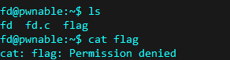
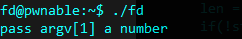
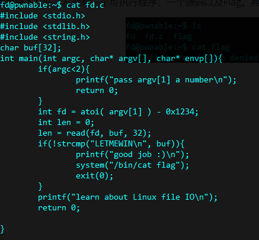
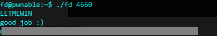

# fd

Mommy! what is a file descriptor in Linux?

- try to play the wargame your self but if you are ABSOLUTE beginner, follow this tutorial link: https://youtu.be/971eZhMHQQw

`ssh fd@pwnable.kr -p2222` (pw: guest)

**The flag IS NOT in the regular format.**

## WP

连接到服务器，使用ls命令查看目录下文件，发现有一个可执行程序，一个源码以及Flag。其中Flag没有阅读权限。

尝试执行程序，提示需要输入参数。

查看程序源码，发现我们输入的参数会被减去`0x1234`后作为`read()`函数的第一个传参，且如果`read()`函数的读取结果为`LETMEWIN\n`，就会打印出Flag。

当`read()`函数的第一个参数为0时，表示读取键盘输入。

因此我们可以输入参数`0x1234`后，再输入`LETMEWIN\n`，即可得到Flag。

