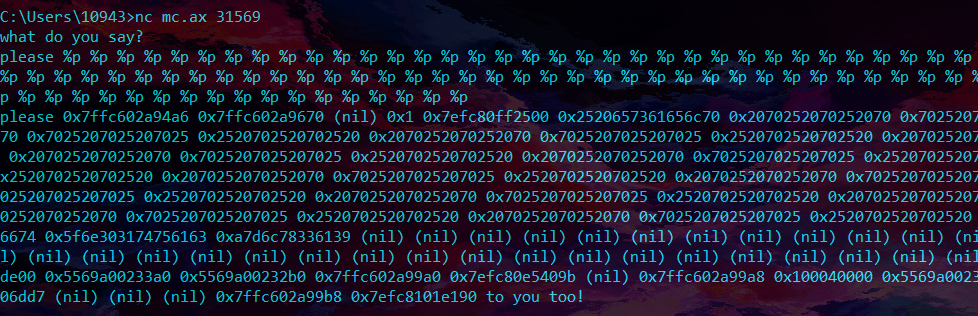
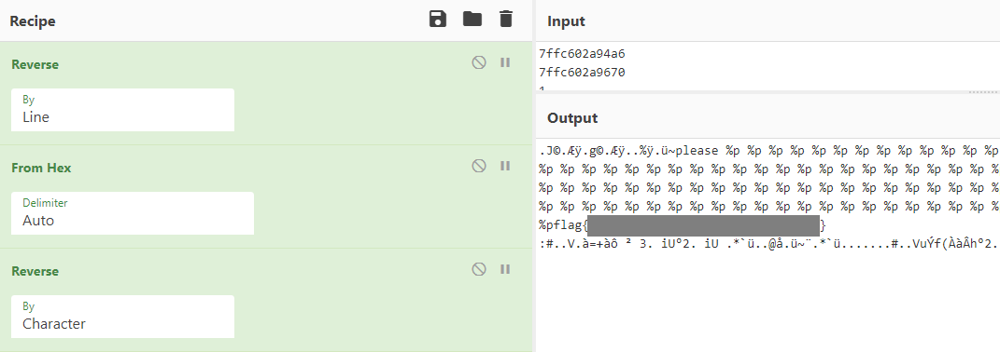

# printf-please

Be sure to say please...

```
nc mc.ax 31569
```

[please.c](https://compass.ctfd.io/files/cc096b82a3a1e35a5a7768a5b7d523d9/please.c?token=eyJ1c2VyX2lkIjoxNCwidGVhbV9pZCI6bnVsbCwiZmlsZV9pZCI6NjF9.YSnUIA.WOJw5ptMHot4yhHRczw32blFH80)	[please](https://compass.ctfd.io/files/3b8ecd34e254c8d9ba92c8c19fcc90f9/please?token=eyJ1c2VyX2lkIjoxNCwidGVhbV9pZCI6bnVsbCwiZmlsZV9pZCI6NjJ9.YSnUIA.rvgm1_WqeLjnXIlrMiiQLKiLW_Q)

## WP

From the source code we can learn that the program has a format-string vulnerability.

```c
if (!strncmp(buffer, "please", 6)) {
  printf(buffer);
  puts(" to you too!");
}
```

There are two things we need to pay attention to:

1. We need to start the format string with `please` or the program will not print the results.
2. Since the program is 64-bit, we need to use `%p` to print the content of the stack instead of `%x` because `%x` will only print 4 bytes but the pointer of the format-string printer will move up by 8 bytes. As a result, if we use `%x` to dump the stack we can only get half of the contents.



Dump the stack with `%p`, decode it and we can get the flag (note that the content of the stack needs to be reversed).



