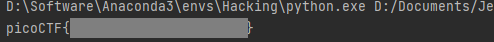

# Dachshund Attacks

What if d is too small? Connect with `nc mercury.picoctf.net 58978`.

##### Hint

> What do you think about my pet? [dachshund.jpg](http://ctf.infury.org:8000/files/438f19f498c307bb322dd0a1b704181e/dachshund.jpg)

## WP

连接到服务器，拿到以下的值。

```xml
e: 20673866176061160319151521270218877500233316363150855857234228065171731984790525800791193454453089246582515933576497024352717432791045427873916248657620689090140111232016520550353733534498977936273572159327866397752287307269660416254959253288560033109366421139872277844926624257753075757990556196544043606791
n: 119763970824808115195092661858337443925175023582602396785678974758667791319977476547185168624511011095018552480980644737564807917251026772085094460752289273018075628378151785353312697516267522643298763490217453711783179265896065668639591241399212830609674824948322963613395420940191572793146836737562661431331
c: 2594321232880968689453243555976096637985818391425694977476331591521018538106939900645830535881664079585292851419796505662228257208110119278353531486110940524735952474022750508500002508445258313000203386489637381726661038366712428085182713810107174411154865014587118748578370083739795553061361564245944810837
```

尝试直接分解`n`，失败。

观察所拿到的值，发现`e`的值特别大，这说明了`d`的值可能很小。同时，题面中的`What if d is too small?`也提示了`d`是一个很小的值。

当`d`的值很小的时候，可以考虑使用**Wiener's Attack**。

使用**Wiener's Attack**脚本破解出`d`。

```
d = 1076327255480067227886216081815341725385244494277602598327028988203711598655
```

使用`d`对密文进行解密后得到Flag。

```python
def calc_m(n, d, c):
    return gmpy2.powmod(c, d, n)


def hex_to_string(m):
    h = hex(m)[2:]
    if len(h) % 2 == 1:
        h = '0' + h
    return ''.join([chr(int(h[i:i + 2], 16)) for i in range(0, len(h), 2)])


n = 119763970824808115195092661858337443925175023582602396785678974758667791319977476547185168624511011095018552480980644737564807917251026772085094460752289273018075628378151785353312697516267522643298763490217453711783179265896065668639591241399212830609674824948322963613395420940191572793146836737562661431331
d = 1076327255480067227886216081815341725385244494277602598327028988203711598655
c = 2594321232880968689453243555976096637985818391425694977476331591521018538106939900645830535881664079585292851419796505662228257208110119278353531486110940524735952474022750508500002508445258313000203386489637381726661038366712428085182713810107174411154865014587118748578370083739795553061361564245944810837
print(hex_to_string(calc_m(n, d, c)))
```



