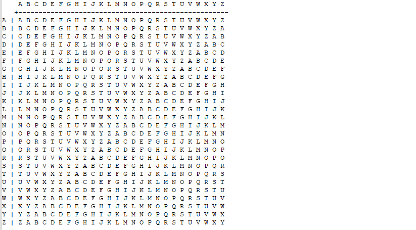
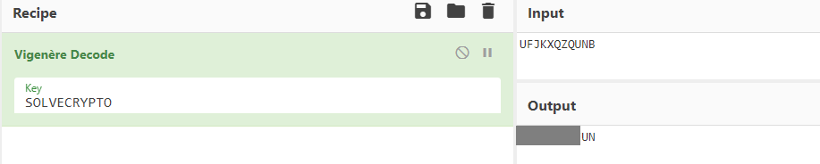

# Easy1

The one time pad can be cryptographically secure, but not when you know the key. Can you solve this? We've given you the encrypted flag, key, and a table to help `UFJKXQZQUNB` with the key of `SOLVECRYPTO`. Can you use this [table](https://jupiter.challenges.picoctf.org/static/1fd21547c154c678d2dab145c29f1d79/table.txt) to solve it?

##### Hint1

>Submit your answer in our flag format. For example, if your answer was 'hello', you would submit 'picoCTF{HELLO}' as the flag.

##### Hint2

>Please use all caps for the message.

## WP

Open `table.txt` and find that the content is an alphabet which is usually used in **Vigenere Cipher**.

Use `UFJKXQZQUNB` as the encrypted string and`SOLVECRYPTO` as the encryption key, we can get the original string reversely.

