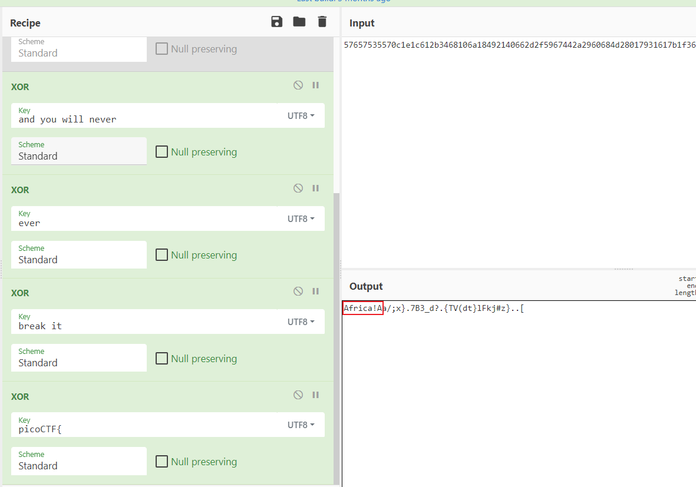
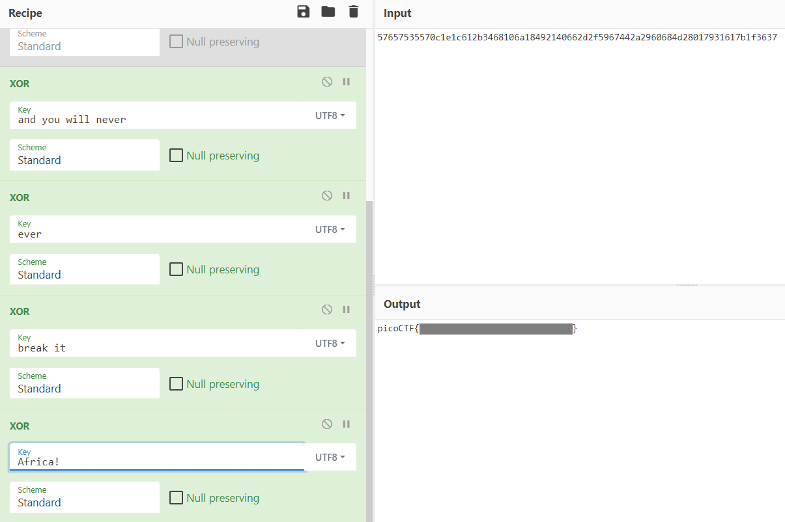

# XtraOrdinary

Check out my new, never-before-seen method of encryption! I totally invented it myself. I added so many for loops that I don't even know what it does. It's extraordinarily secure!

[output.txt](https://artifacts.picoctf.net/picoMini+by+redpwn/Cryptography/xtraordinary/output.txt)

[encrypt.py](https://artifacts.picoctf.net/picoMini+by+redpwn/Cryptography/xtraordinary/encrypt.py)

## WP

通过查看`crypt.py`文件可以发现，加密采用的是异或加密。

```python
def encrypt(ptxt, key):
    ctxt = b''
    for i in range(len(ptxt)):
        a = ptxt[i]
        b = key[i % len(key)]
        ctxt += bytes([a ^ b])
    return ctxt
```

在之后的代码段中，对Flag使用了一些字符串进行了多次异或加密。

```python
random_strs = [
    b'my encryption method',
    b'is absolutely impenetrable',
    b'and you will never',
    b'ever',
    b'ever',
    b'ever',
    b'ever',
    b'ever',
    b'ever',
    b'break it'
]

for random_str in random_strs:
    for i in range(randint(0, pow(2, 8))):
        for j in range(randint(0, pow(2, 6))):
            for k in range(randint(0, pow(2, 4))):
                for l in range(randint(0, pow(2, 2))):
                    for m in range(randint(0, pow(2, 0))):
                        ctxt = encrypt(ctxt, random_str)
```

由于对一个字符串使用同一个key进行两次异或加密后会变回原字符串，因此这些循环其实没有必要，对于`random_strs`列表中的每个key，只有两种可能：这个key对原文进行了加密，或没加密。同时，中间重复的多次`ever`字符串可以减缩为一条。

因此，原文被加密的情况只有`2^5=32`种。

然而，我们现在并没有办法确定原文采用了哪种加密组合，因为被加密的原文在一开始被key进行了异或加密，且我们不知道key是什么。

```python
ctxt = encrypt(flag, key)
```

但是，我们可以通过一个信息反推出key：Flag字符串原文的开头一定是`picoCTF{`。

我们将被key加密过的字符串和`picoCTF{`做异或加密，那么前8位一定是key。而且，我们可以通过以下两个特征判断正确的key：

+ 正确的key很有可能是一个有意义的字符串。
+ 如果正确的key不足8位，那么在前8位会出现重复片段。

接下来，我们需要遍历32种加密组合，找到可能是正确的key。



最终，在使用了`and you will never`，`ever`，`break it`这三个字符串的加密组合中发现了前8位为`Africa!A`，该字符串符合上述两个特征，推测正确的key应为`Africa!`。



使用key为`Africa!`进行解密，得到Flag。