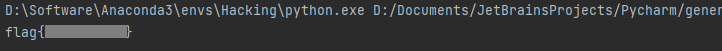

# baby

I want to do an RSA!

[output.txt](http://ctf.infury.org:8000/files/6ee7a75c9f6ef03125ec36528c62ffbd/output.txt?token=eyJ1c2VyX2lkIjoxNCwidGVhbV9pZCI6bnVsbCwiZmlsZV9pZCI6NzF9.YPuzvg.MOYf01HmaVAH7p6pYFdMwKcF89c)

## WP

Open the downloaded file then we can get `n`, `e` and `c`.

```xml
n: 228430203128652625114739053365339856393
e: 65537
c: 126721104148692049427127809839057445790
```

We can factorize the `n` to `p` and `q` on [factordb](http://factordb.com), and then we can decrypt the message `c`.



