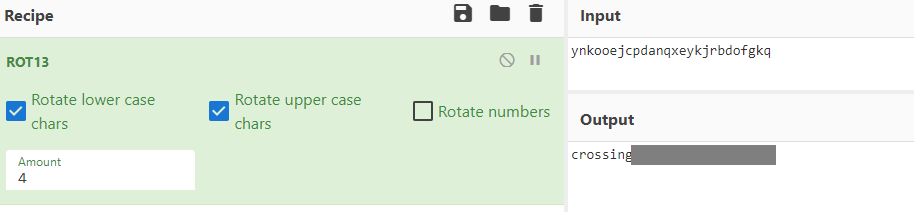

# caesar

Decrypt this [message](http://ctf.infury.org:8000/files/c6271bfa60a5f571299f1ab2209ee964/ciphertext).

##### Hint

> caesar cipher [tutorial](https://learncryptography.com/classical-encryption/caesar-cipher)

## WP

打开文件，拿到密文。

```xml
picoCTF{ynkooejcpdanqxeykjrbdofgkq}
```

根据密文内容和题目提示可知，`picoCTF{}`内的字符串经过了凯撒加密。

CyberChef中选择ROT13解密，调整偏移量，最终获得Flag。



