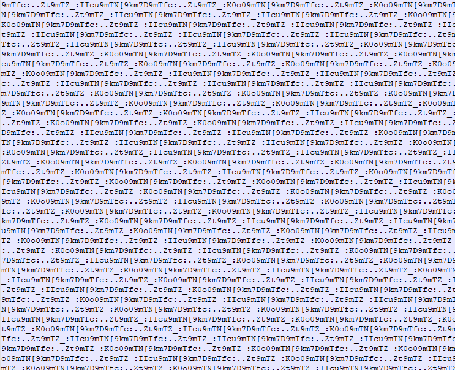
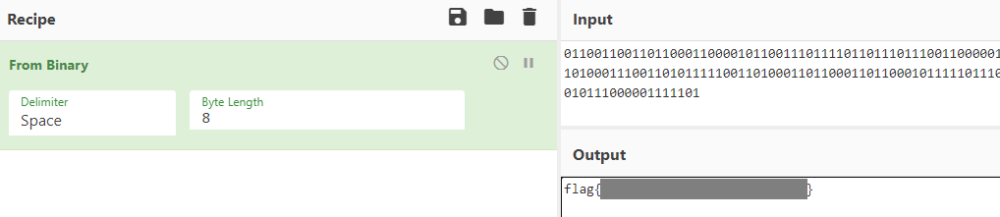

# round-the-bases

My flag has been all around the bases. Can you help me get it back?

[round-the-bases](http://ctf.infury.org:8000/files/215beee77d920e1b3ec90d648d2dedd6/round-the-bases?token=eyJ1c2VyX2lkIjoxNCwidGVhbV9pZCI6bnVsbCwiZmlsZV9pZCI6NzJ9.YPu5uQ.T5SbQDx4YAto0pvDRkeKJAgHUJU)

## WP

Open the file, and then we may find that the content seems make no sense.

But once we take a closer observation, we can find that the content consists of mainly two patterns: `[9km7D9mTfc:..Zt9mTZ_:K0o09mTN` and `[9km7D9mTfc:..Zt9mTZ_:IIcu9mTN`. Think of the word `bases` in the title, we can consider the possibility of binary.

The first and last pattern of the content is incomplete, but we can still recognize that the first pattern is `[9km7D9mTfc:..Zt9mTZ_:IIcu9mTN`.

Let `[9km7D9mTfc:..Zt9mTZ_:K0o09mTN` be `1` and `[9km7D9mTfc:..Zt9mTZ_:IIcu9mTN` be `0`, we can get a binary string with the last bit unknown. We can solve this problem by enumeration and finally we can get a binary string with 264 bits.

Decode this string and then we can get the Flag.