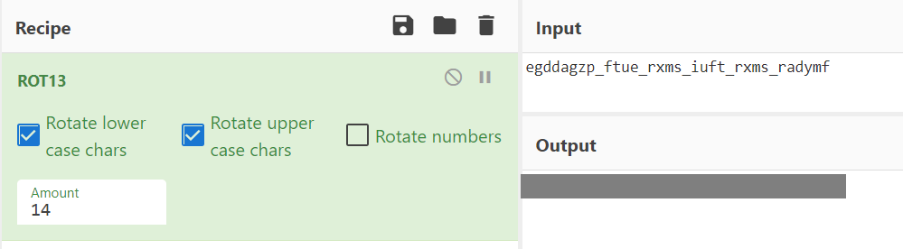

# scissor

I was given this string and told something about scissors.

```xml
egddagzp_ftue_rxms_iuft_rxms_radymf
```

[encrypt.py](http://ctf.infury.org:8000/files/97984492bee7bdd301627533977f53f1/encrypt.py?token=eyJ1c2VyX2lkIjoxNCwidGVhbV9pZCI6bnVsbCwiZmlsZV9pZCI6NTB9.YPaAwQ.xtIVMRJGkmZD5zwxICAA78zxgRU)

## WP

查看加密脚本，发现就是一个简单的偏移加密。

```python
import random

key = random.randint(0, 25)
alphabet = 'abcdefghijklmnopqrstuvwxyz'
shifted = alphabet[key:] + alphabet[:key]
dictionary = dict(zip(alphabet, shifted))

print(''.join([
    dictionary[c]
    if c in dictionary
    else c
    for c in input()
]))
```

放入CyberChef中使用ROT13方式解密，调整偏移量至14即可得到Flag。

