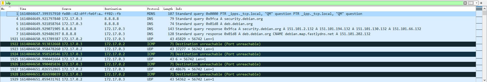
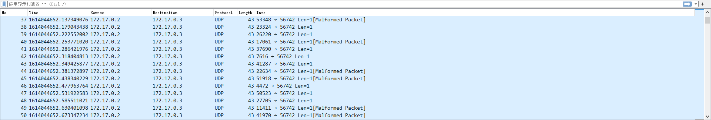
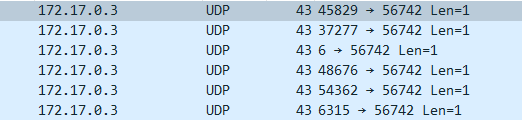
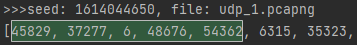
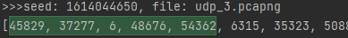
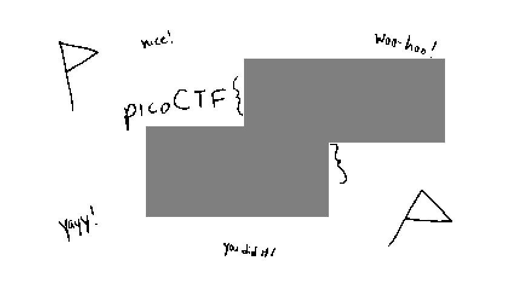

# scrambled-bytes

I sent my secret flag over the wires, but the bytes got all mixed up!

[capture.pcapng](https://artifacts.picoctf.net/picoMini+by+redpwn/Forensics/scrambled-bytes/capture.pcapng)

[send.py](https://artifacts.picoctf.net/picoMini+by+redpwn/Forensics/scrambled-bytes/send.py)

## WP

#### 寻找关键的报文

打开`send.py`，可以看见加密发送Flag的原理：将Flag先打乱，然后对Flag中的每个字符用随机数进行异或加密后，通过UDP协议从本地的随机端口发出。

```python
with open(args.input, 'rb') as f:
    payload = bytearray(f.read())
random.seed(int(time()))
random.shuffle(payload)
with IncrementalBar('Sending', max=len(payload)) as bar:
    for b in payload:
        send(
            IP(dst=str(args.destination)) /
            UDP(sport=random.randrange(65536), dport=args.port) /
            Raw(load=bytes([b ^ random.randrange(256)])),
            verbose=False)
        bar.next()
```

因此，我们需要注意的就是抓包记录中的UDP报文。



将这些UDP报文中长度不为43的报文删去后导出。



由于在这些过滤过的UDP包中还存在着一些Malformed的包，不知道是否应该保留，且还有两个基于UDP但为其他协议的包（A21和Teredo），不知道是否应该保留，因此导出三个版本的抓包记录：

* `udp_1.pcapng`：含有所有包的记录
* `udp_2.pcapng`：仅含有正常（非Malformed）的包的记录
* `udp_3.pcapng`：仅含有仅为UDP协议的包的记录

由于两个其他协议的包被Wireshark判定为Malformed，因此在`udp_2.pcapng`中没有这两个协议的报文。

#### 寻找随机数种子

由于Flag是被随机打乱且被随机数进行了异或加密后发出的，因此即使我们已经拿到了发送的数据，这样的加密方法似乎依旧无解。

但是在`send.py`中，有一句关键代码：

```python
random.seed(int(time()))
```

在原脚本中生成的随机数其实是被指定了种子的，也就是说我们只要找到这个种子，就能完美复制出一模一样的随机操作。

根据抓包记录中的信息，我们可以推断出执行这段代码的时间应该是在`1614044645`到`1614044655`之间，因此种子应该在这个范围内。

我们可以通过一个信息来判断正确的种子：发送的端口号。

我们用不同的种子和不同的抓包记录组合，模仿`send.py`中的操作，生成一系列端口号，脚本如下：

```python
import random

import pcapng.blocks
from pcapng import *

pcapng_list = ['udp_1.pcapng', 'udp_2.pcapng', 'udp_3.pcapng']
for file in pcapng_list:
    with open(file, 'rb') as pc:
        data_list = []
        data = FileScanner(pc)
        for block in data:
            if block.__class__ == pcapng.blocks.EnhancedPacket:
                data_list.append(block.packet_payload_info[2][-1])
            else:
                continue
        for seeds in range(1614044645, 1614044660):
            random.seed(seeds)
            port_list = []
            init = [i for i in range(0, len(data_list))]
            random.shuffle(init)
            for b in data_list:
                port_list.append(random.randrange(65536))
                new_data.append(b ^ random.randrange(256))
            print(f'>>>seed: {seeds}, file: {file}')
            print(port_list)
```

除了`random.randrange(65536)`以外，`shuffle()`，`random.randrange(256)`这两个函数也不能少，否则会影响到随机数的生成。



抓包记录中，前几个端口号分别为`45829`，`37277`，`6`，`48676`，`54362`。我们在输出的结果中搜索这几个端口号。





最终找到两个可能正确的组合，其中正确的seed确定为`1614044650`，正确的抓包记录可能为`udp_1`或`udp_3`。

#### 恢复数据

接下来，使用脚本将这两份数据分别恢复，脚本如下：

```python
import random

import pcapng.blocks
from pcapng import *

pcapng_list = ['udp_1.pcapng', 'udp_3.pcapng']
for file in pcapng_list:
    with open(file, 'rb') as pc:
        data_list = []
        data = FileScanner(pc)
        for block in data:
            if block.__class__ == pcapng.blocks.EnhancedPacket:
                data_list.append(block.packet_payload_info[2][-1])
            else:
                continue
        random.seed(1614044650)
        port_list = []
        new_data = []
        init = [i for i in range(0, len(data_list))]
        random.shuffle(init)
        for b in data_list:
            port_list.append(random.randrange(65536))
            new_data.append(b ^ random.randrange(256))
        new_str = [0] * len(new_data)
        ptr = 0
        for index in init:
            new_str[index] = new_data[ptr]
            ptr = ptr + 1
        print(f'>>> file: {file}')
        print(''.join([chr(c) for c in new_str]))
```

输出结果如下：

```xml
>>> file: udp_1.pcapng
‰PNG

Þyºèu™¶ý&³ýëf
6é@‘UJ)¥Î'MÜU6yþöõf–æ=éœôM:
«ñ£‹g/ù3{<£”Ú°tÉVeJ€ò-F®b“äúƑc[6ê¨Sœ2eÌ*ë@u
·ÚÕëúô˜cQ¥iö›ÐcÈ*§í´vþq(õ	­:•}´æ“ýì½ÇŸ¸G%g¬Ú^'Hž
ù‹lgä<.8%à+æ‡N0ÈýìoʵÏÐz!C%Ùd|¤Õ̵õMØÛٓ½H³±v¸€©ë½ªÖK\ÀƒKæ(T Qì jzpێõ
;öbç ¹gÅ|GM¦éšè Igˀ¥­¼Ðí_ÏJ‚¼Ñlw#¡sdÀ29ëïfI™—>
g߀SÑKpzÏ»ÁÁÖdLr aìz8ê›`Œ¡ª[>º:êû8–íßt?ù2ð¸×jN¹†w“àÜœ(+ð[`c&À¦²ðœFl€k’»‰ìi„\¬ÍØÌàدÓUÅ:’c@Ëa™ò¤~°0c!«úÙÝ Ù M”w„[aŸ={®˜õÚô$Âÿ©d•ñ2¼‚El¡T0¢§·1¹Ó/ekÚ,+ØúH+ȨoiÝì6¢û´_ʎñLw)L[Üa·V´ëïû†H¬K$üŠ+¡¡MöŸ@ñ5釆é]‡¹ÛȈj´]%8obšõ—CøžÙ¬‡ÀßÅ´tՆ32	,5uØÉÂÁ¥´…à¤ñ®¨Ô9öORý?'îe€Ó5½ªæ0ÔÕ>Ÿ BÕK7°Þ#Z±^íç;k€ñ4ZK"Ã<kœ:B³@6bxБ墂ÏX±WêEƏšV‹âAÑ£¨Ñ^evNó•Ï¦Íæt>ú֞ܯúý8‘W®HôÄ|é[ê߉BwaÀ2Ø(L—Á
qtYJ§¹þô;M߄W¶Q“²òw¥9&±Òޔ»r¿+Ù3Ç|ÓÙ¢$ÆË8Û;—ЄÕE©ŒŒØr2Çú-‡çÓ&΅•7ëÖ{wig±nc©c¥œ5053ܚ\.݁VP>µÛ0ïIn–
ʾWӓ/ðšµÎŠÝe¼N¨Ç^:db7Ū=ã}~jŸ6,fUvíW¥6/™v9ìtlK§ÕK|Õf‡—“廤¡îCÎîì»À.°ƒý½»L±g¨â÷    IEND®B`‚
>>> file: udp_3.pcapng
B»qÐlÍ~˜ZÆ,ÀS\^Óð¯7ž ¯s€OÇ? =6é'ú¥£¢¶<U‰O왇õßÆW–+‘ÿ†
vÎ
Lі¬¾ñœ‘òzN5ýX(ÓÉB—n€èÀ÷åï£ñR@žE:Î/5>uªÆß>7U§Õ1ƒ	&<Ôƞ=¢í«È$¢RCu`ýß÷¶P•7ÈCnjéLn©Ãñpì'[œ
–è¸éëù5ÁÑætÇíIàþ#C»‹a!rÇvéfU%Á«_$EtÏK´‡ß@b5‡H܃Å£¶-l^xŦ4»ØLzþ‘ú„Ù@§P¤K¿X̗-¸çÌ(rË-Í*R+{qùLm[ö±NÛåÿö ~zà%UêêéŒn5´T¼G	yÒ
f;>»[e+ˆ}çGÓµã0 -Æä;†Qôÿ=°,W·Ì
Æ<©Ž¢ÒhšÞþ6ŠøÍÁPÏÍÔ¤sŠûãí®É8[óa®6îژ”.i2Üã×w1g*¦ÑŸ©ðH9ín"‡º»µ³™x®þîôéP´ÄÅe›éïý(›¸’ú¥¿Z}€ÈA"o+‡;RiJÀX€ØDYÞ'—ogÆnGM퐦MU'´ž
Cüxh;!Mj&àäBtvÞßИôÖÊ$ïPYqÏìåˆ8þΰB9ÐÞ=ã‚i$!ɨ=\rÜVÑÐJTf·¯ÉŽ?ÒqÃÇéŽÉY¨‰ìw(mße©ø¤Oz¯Ã]ƀo½_3ø¶¿Èh„šdG’ê ²ˆ3¢e©K‘ý ìßÉ5Šû=ò|§qÅÎ]¡™·|x;Ι¢P~ˆ|êðU¸Ÿ$7õ®HÐQf<µdÝ'×)}¤]°Çjuá
```

可以看到，当采用`udp_1`的抓包记录时，出现了`PNG`的文件头。

将`udp_1.pcapng`的数据复原后输出到PNG图片中，得到的图片中即是Flag。

