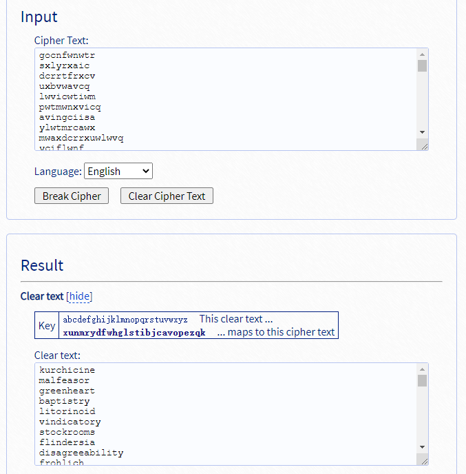
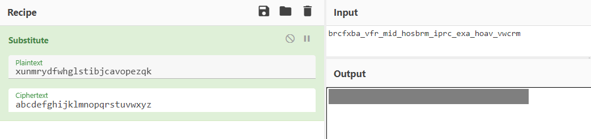

# spelling-quiz

I found the flag, but my brother wrote a program to encrypt all his text files. He has a spelling quiz study guide too, but I don't know if that helps.

[public.zip](https://artifacts.picoctf.net/picoMini+by+redpwn/Cryptography/spelling-quiz/public.zip)

## WP

根据题目提示，我们需要将`flag.txt`中被加密的复原。

查看`encrypt.py`，发现采用的加密为代换加密，且同时题目还给出了一个被用同样的key加密过的单词表。

```python
alphabet = list('abcdefghijklmnopqrstuvwxyz')
random.shuffle(shuffled := alphabet[:])
dictionary = dict(zip(alphabet, shuffled))

for filename in files:
    text = open(filename, 'r').read()
    encrypted = ''.join([
        dictionary[c]
        if c in dictionary else c
        for c in text
    ])
```

一开始尝试对单词表中出现的字母进行字频统计并手动解密，后来发现单词表中的字频并不典型，手动解密工作量很大。

于是采用自动化解密。进入一个在线的代换加密分析器，输入单词表，大约半分钟后可以分析出代换加密的key。



使用该key对加密后的Flag进行解密即可。

