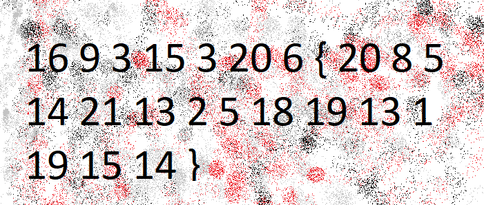

# The Numbers

The [numbers](https://jupiter.challenges.picoctf.org/static/f209a32253affb6f547a585649ba4fda/the_numbers.png)... what do they mean?

##### Hint

> The flag is in the format PICOCTF{}

## WP

下载文件发现是一张图片，其中是用空格分隔的数字和`{}`，很明显是和字母表一一对应。

根据提示中的`PICOCTF{}`，推测全为大写，转换为大写字母后即为Flag。

