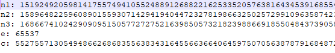
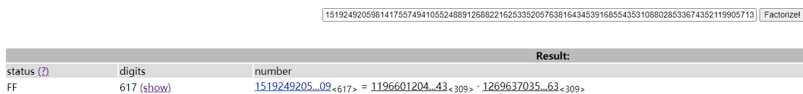
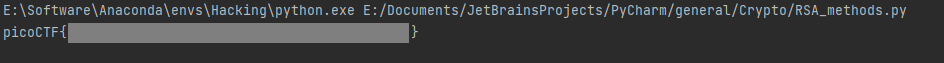

# triple-secure

To get the flag, you must break RSA not once, but three times!

[public-key.txt](https://artifacts.picoctf.net/picoMini+by+redpwn/Cryptography/triple-secure/public-key.txt)

[encrypt.py](https://artifacts.picoctf.net/picoMini+by+redpwn/Cryptography/triple-secure/encrypt.py)

## WP

打开`public-key.txt`，看到文件中给定了三个模数，一个公钥和一个密文。



查看`encrypt.py`，可以发现三个模数的生成方式，以及加密过程。

```python
p = getPrime(1024)
q = getPrime(1024)
r = getPrime(1024)

n1 = p * q
n2 = p * r
n3 = q * r

moduli = [n1, n2, n3]

e = 65537
c = bytes_to_long(flag)

for n in moduli:
    c = pow(c, e, n)
```

在三个模数中，第一个模数`n1`可以直接通过factordb查找到分解结果，另外两个则不行。



不过知道生成原理之后，可以计算得出r，这样我们就知道p，q，r的值了。

有一点值得一提，在python中进行除法时，默认为浮点数除法，在大数除法中精度无法得到保证。此时可以考虑使用整数除法（类似于其他语言中的除法，使用`//`表示）以保证精确度。

然后使用脚本对c进行解密，使用的模数顺序为n3，n2，n1，脚本如下：

```python
import gmpy2
from Crypto.Util.number import long_to_bytes

def calc_m(p, q, e, c):
    n = p * q
    phi_n = (p - 1) * (q - 1)
    d = gmpy2.invert(e, phi_n)
    return pow(c, d, n)

m = calc_m(p, q, e, calc_m(p, r, e, calc_m(q, r, e, c)))

print(long_to_bytes(m).decode())
```

解密后成功得到Flag。



