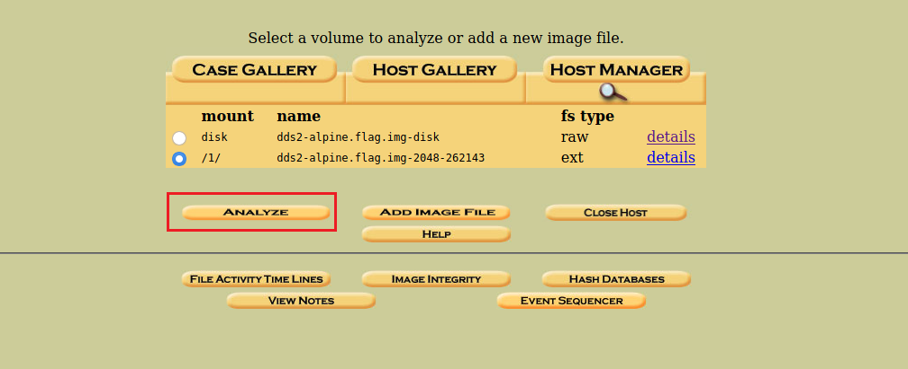
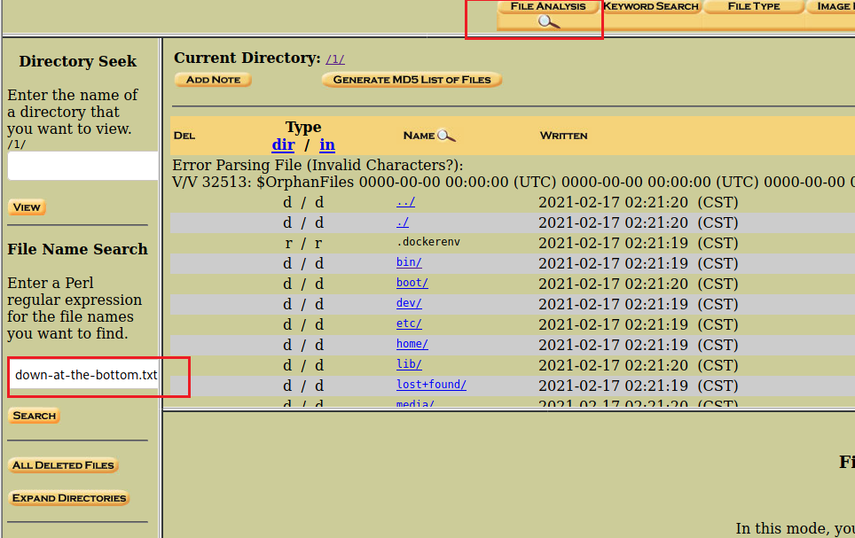
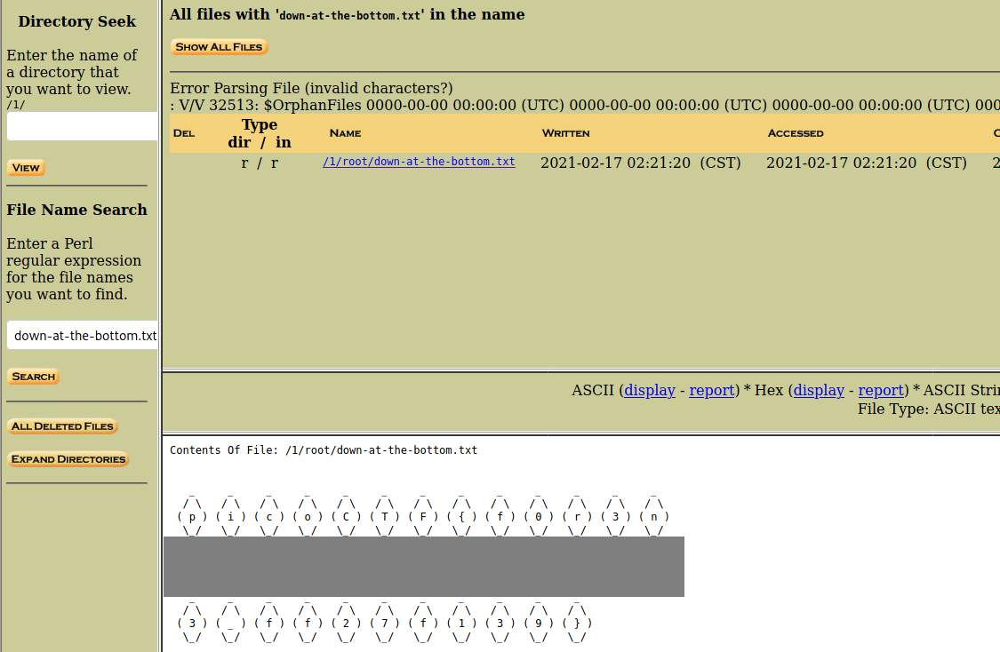

# Disk, disk, sleuth! II

All we know is the file with the flag is named `down-at-the-bottom.txt`... Disk image: [dds2-alpine.flag.img.gz](http://ctf.infury.org:8000/files/7eca7c796b39237623b98366d2709711/dds2-alpine.flag.img.gz)

##### Hint 1

> The sleuthkit has some great tools for this challenge as well.

##### Hint 2

> Sleuthkit docs here are so helpful: [TSK Tool Overview](http://wiki.sleuthkit.org/index.php?title=TSK_Tool_Overview)

##### Hint 3

> This disk can also be booted with qemu!

## WP

Open the `.img` file in autopsy, just like [Disk-disk-sleuth](Disk-disk-sleuth.md).

Choose `/1/` and analyze.

Choose `FILE ANALYSIS`, and then search for the file named `down-at-the-bottom.txt`.

Open the file and we can get the flag.

