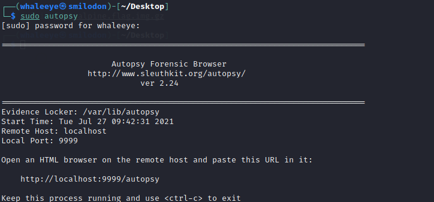
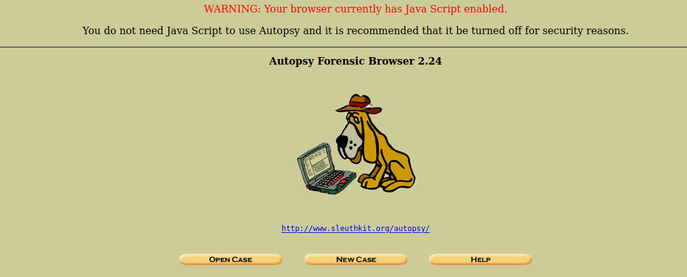
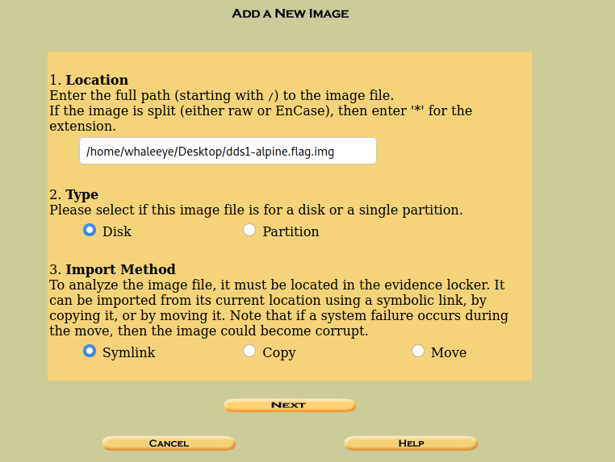
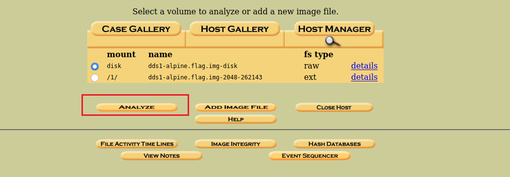
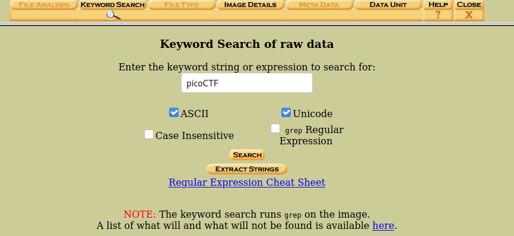
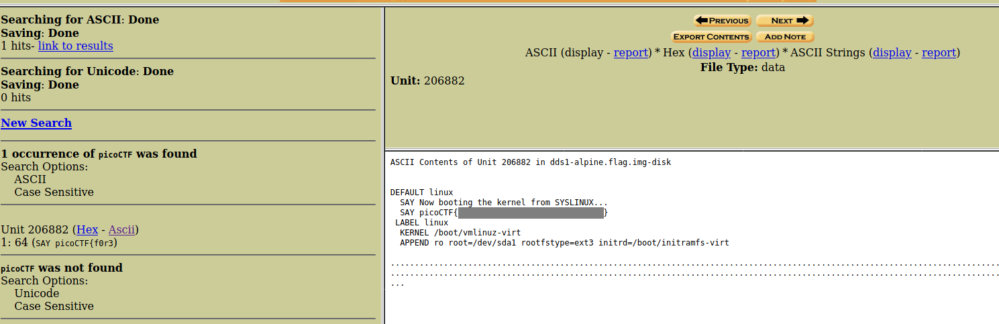

# Disk, disk, sleuth!

Use `srch_strings` from the sleuthkit and some terminal-fu to find a flag in this disk image: [dds1-alpine.flag.img.gz](https://mercury.picoctf.net/static/ac394d24f88e51a09cc909687cf6d853/dds1-alpine.flag.img.gz)

##### Hint 1

> Have you ever used `file` to determine what a file was?

##### Hint 2

> Relevant terminal-fu in picoGym: https://play.picoctf.org/practice/challenge/85

##### Hint 3

> Mastering this terminal-fu would enable you to find the flag in a single command: https://play.picoctf.org/practice/challenge/48

##### Hint 4

> Using your own computer, you could use qemu to boot from this disk!

## WP 1

`gunzip` the `.img.gzip` file and we can get a image file.

According to the hints, we can use sleuthkit to analyze the image file and find the flag inside.

Open autopsy, the graphical interface of sleuthkit.

Open the UI in browser.

NEW CASE --> ADD HOST.

Add the image file into sleuthkit.

 

Analyze the disk, and use keyword search to search for `picoCTF`.

Finally we can get the flag.

## WP 2

We can get the flag directly by using `strings` combined with `grep`.

