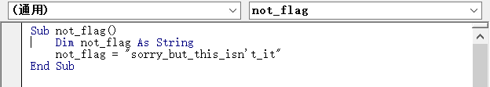
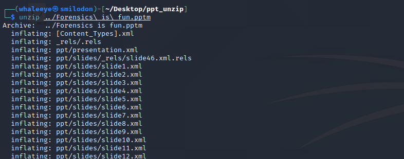
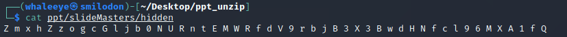
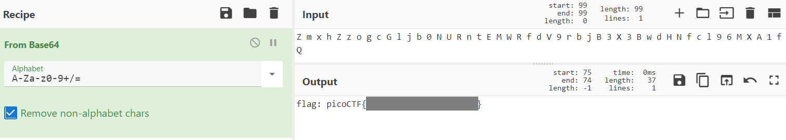

# MacroHard WeakEdge

I've hidden a flag in this file. Can you find it? [Forensics is fun.pptm](https://mercury.picoctf.net/static/d3dd8cd51524d9fafcccd1b7d55f85e7/Forensics is fun.pptm)

## WP

下载文件后，直接打开会显示文件损坏，修复后查看宏，只看到一个名字为not_flag的宏，很明显不是Flag。

猜测Flag应该隐藏在“损坏”的文件内容中，但由于PPT本身是经过处理的，无法直接通过查看十六进制的方式获取PPT明文。

查找资料后发现，PPT实际上是一个zip压缩文件，可以使用`unzip`命令进行解压。

解压后，发现一个可疑的文件`ppt/slideMasters/hidden`，通过`cat`命令查看。

显然是被加密过，根据加密后字符串推测加密方式为BASE64。

BASE64解码得到Flag。

