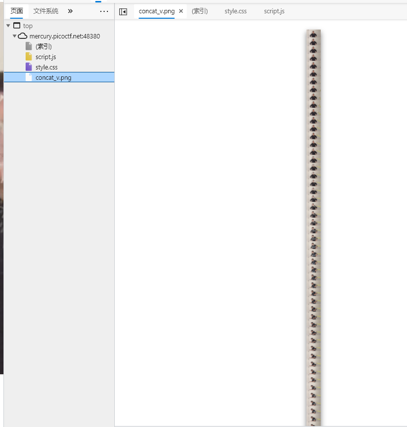
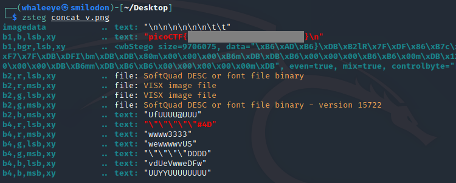

# Milkslap

[🥛](http://mercury.picoctf.net:48380/)

##### Hint

> Look at the problem category.

## WP

进入网站后，发现网站的内容就是根据我们指针的位置显示动图的不同帧。

查看元素可以发现，被显示的动图其实是一张很长的PNG格式图片。

由于这道题属于Forensic，因此我们应该对这张图片下手。

保存图片到本地，查看EXIF信息中是否存在Flag，无；检查是否包含了其他文件，无。

于是用`zsteg`对其进行低位隐写检查。

最终，在蓝色通道最低位发现了被隐写的Flag。