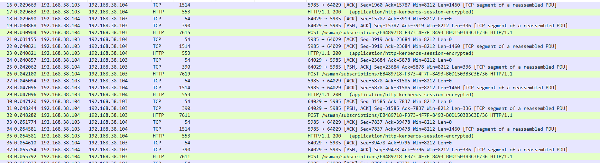
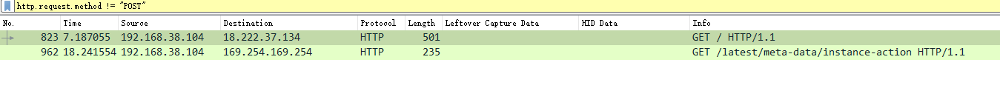
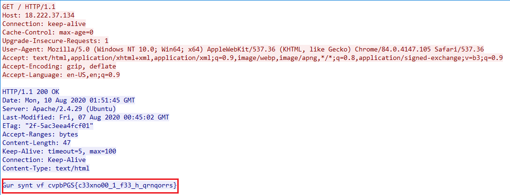
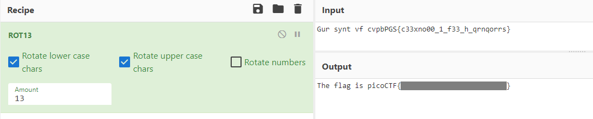

# Wireshark doo dooo do doo...

Can you find the flag? [shark1.pcapng](https://mercury.picoctf.net/static/ae5b2bc07928fca272ff3900dc9a6cef/shark1.pcapng).

## WP

下载抓包记录，打开后发现有大量类似的POST请求。

这道题我的解法其实是歪打正着。想着先把这些庞杂的POST请求过滤掉，结果直接找到了关键的包。

使用`http.request.method != "POST"`语法进行过滤，最后只剩下了两个GET请求包。

追踪第一个包的TCP流，发现服务器的回包中包含有一个特殊的字符串。

但这串字符串明显需要进一步处理，考虑到该字符串形式已经很像Flag了，应该是偏移加密。

使用ROT13进行解密，成功得到Flag。

