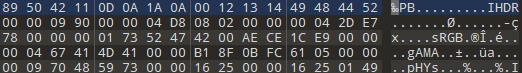
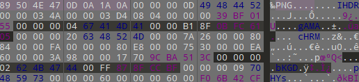
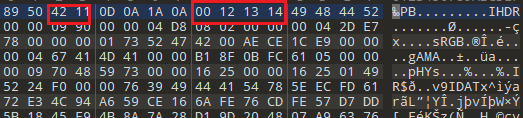
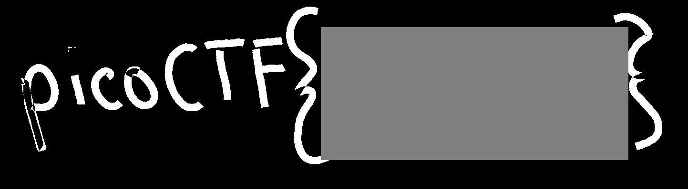

# advanced-potion-making

Ron just found his own copy of advanced potion making, but its been corrupted by some kind of spell. Help him recover it!

https://artifacts.picoctf.net/picoMini+by+redpwn/Forensics/advanced-potion-making/advanced-potion-making

## WP

下载给定文件，没有后缀名。使用file命令进行检测，居然检测不出来，因此考虑文件头受损。

使用十六进制编辑器打开文件，根据IHDR，sRGB等字眼判断出这是一张受损的PNG格式的图片。

下载一张正常的PNG图片，将文件头部部分进行比较，修改受损文件的错误部分。

与上方正常PNG进行比较，下方受损PNG共出现了两处错误，修改正常后，改后缀名为PNG打开，发现是一张纯红色图片，还需要进一步处理。

使用Stegsolve进行查看，最终可以在某些图层中看到Flag。

