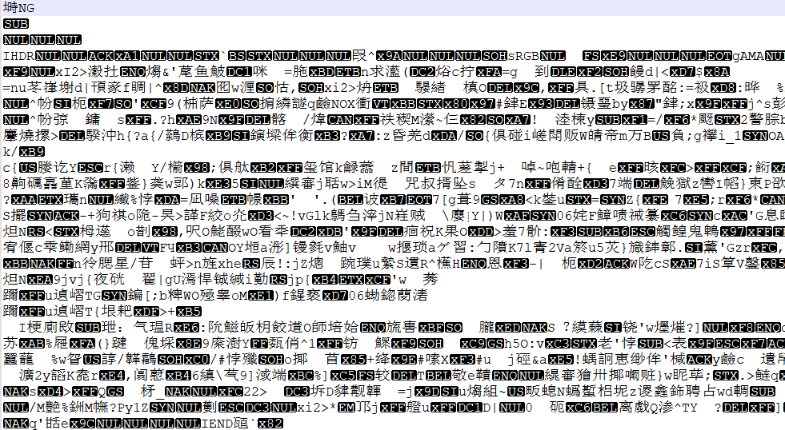

# extensions

This is a really weird text file [TXT](http://ctf.infury.org:8000/files/a64006a5f2192e4494b0f44d4c988ad9/flag.txt)? Can you find the flag?

##### Hint 1

> How do operating systems know what kind of file it is? (It's not just the ending!

##### Hint 2

> Make sure to submit the flag as picoCTF{XXXXX}

## WP

Download the file and open it. Obviously it is not a simple text file.

Use `file` command to check it and we find that it's a PNG file.

Modify its extension to `.png` and open it. Then we can get the flag.

