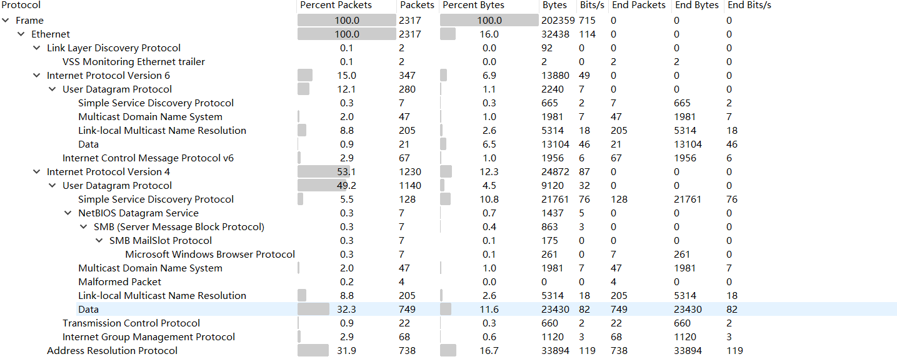
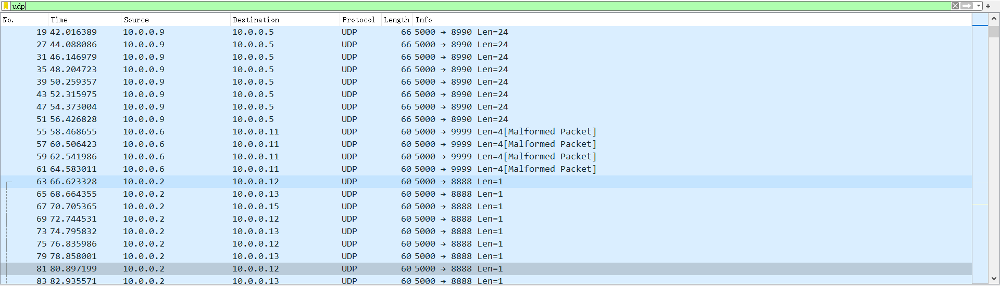
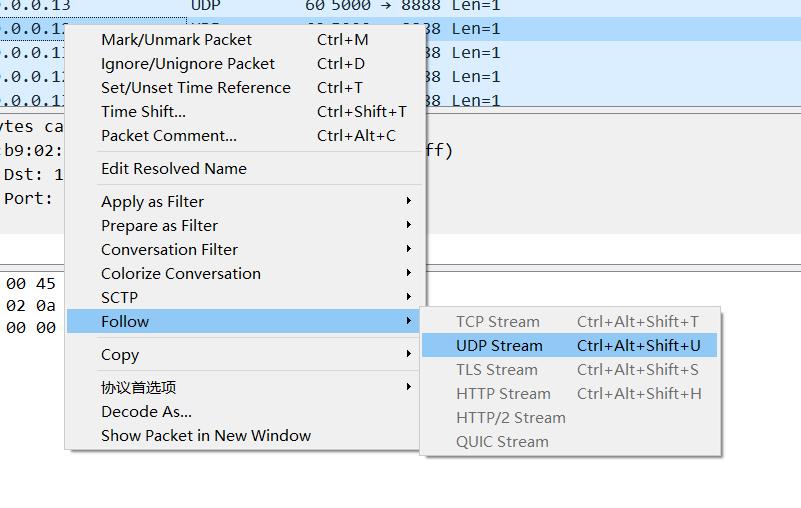
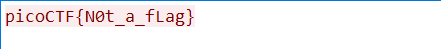
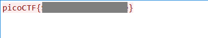

# shark on wire 1

We found this [packet capture](http://ctf.infury.org:8000/files/a82afb7359e58c581780935f52322575/capture.pcap). Recover the flag.

##### Hint 1

> Try using a tool like Wireshark

##### Hint 2

> What are streams?

## WP

Open the `.pcapng` file in Wireshark, and then choose `Statistics --> Protocol Hierarchy` to see the details of the protocols in this file.

We can get that there are a lot of UDP packets in the record and it takes up nearly 50% of the packets.

Use the filter to filter out the UDP packets.

As we can see, there are lot of discrete UDP packets.

We can use `Follow --> UDP Stream` to see the whole stream. In that case, we can get the discrete packets together.

Follow the UDP stream from `10.0.0.2` to `10.0.0.13`, we can see a string `picoCTF{N0t_a_fLag}`. Obviously this is not the flag.

Try other UDP streams. Finally we can find the flag in the UDP stream from `10.0.0.2` to `10.0.0.12`.

