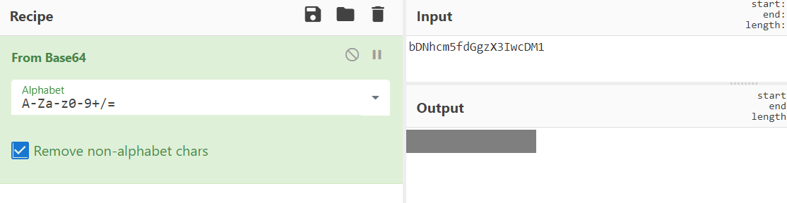

# Bases

### Description

What does this `bDNhcm5fdGgzX3IwcDM1` mean? I think it has something to do with bases.

##### Hint

> Submit your answer in our flag format. For example, if your answer was 'hello', you would submit 'picoCTF{hello}' as the flag.

### Writeup

将原字符串使用BASE64解码后使用`picoCTF{}`包裹即为Flag。

