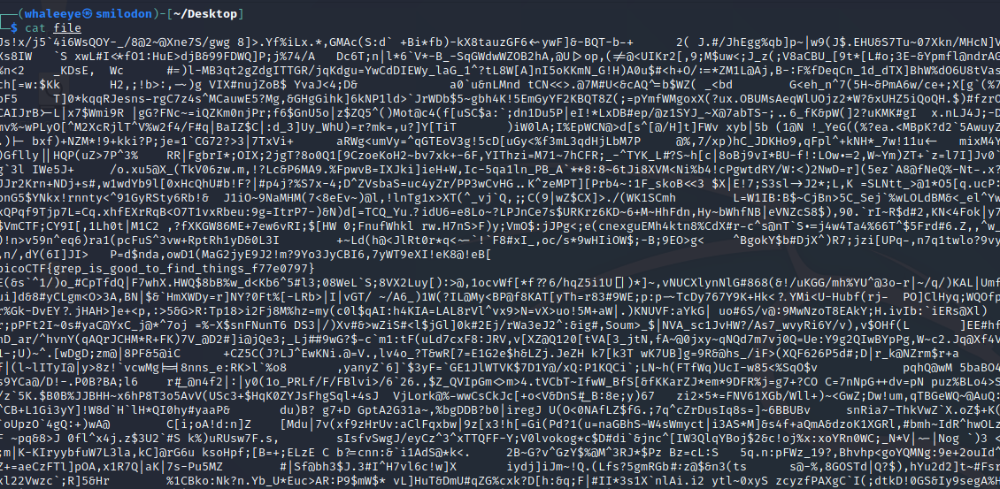
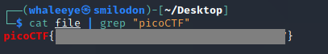

# First Grep

### Description

Can you find the flag in [file](http://ctf.infury.org:8000/files/eb24df39326513c7a5f9a6a7ae4f0343/file)? This would be really tedious to look through manually, something tells me there is a better way.

##### Hint

>grep [tutorial](https://ryanstutorials.net/linuxtutorial/grep.php)

### Writeup

下载文件后，如果直接查看文件内容，发现信息量较大。

当然可以直接肉眼查找Flag，但是按照题目的思路，此处使用grep对`picoCTF`字段进行查找，即可找到Flag。

