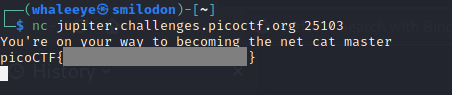

# what's a net cat?

Using netcat (nc) is going to be pretty important. Can you connect to `jupiter.challenges.picoctf.org` at port `25103` to get the flag?

##### Hint

> nc [tutorial](https://linux.die.net/man/1/nc)

## WP

使用`nc`命令连接到目标服务器即可拿到Flag。

