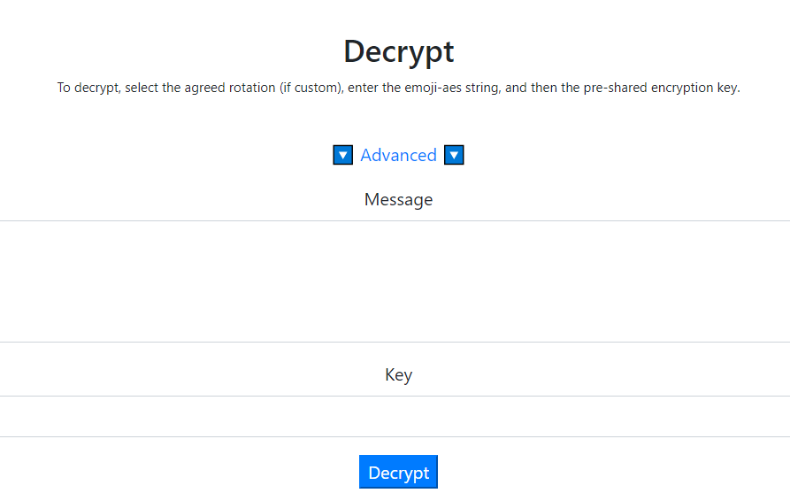
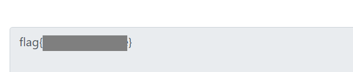

# 签到

### Description

**From巅峰极客赛2021**

YY给我发了一串表情，说了GAME，这是什么意思？

[qiandao.zip](http://ctf.infury.org:8000/files/8fc7bee1db9dac2af91bf4a977e5b37f/qiandao.zip?token=eyJ1c2VyX2lkIjoxNCwidGVhbV9pZCI6bnVsbCwiZmlsZV9pZCI6ODB9.YQuw3w.zRCESLGQxq6TDODZrSOfmBp2po0)

### Writeup

Download the file and open the text file in it, we can find a string of emojis. It seems like some kind of encryption.

```xml
🙃💵🌿🎤🚪🌏🐎🥋🚫😆😍🥋🐘🍴🚰😍☀🌿😇😍😡🏎👉🛩🤣🖐💧☺🌉🏎😇😆🎈💧⏩☺🔄🌪⌨🐅🎅🙃🍌🙃🔪☂🏹🕹☃🌿🌉💵🐎🐍😇🍵😍🐅🎈🥋🚰✅🎈🎈
```

Search about emoji encryption in CTF online, then find a website [emoji-aes](https://aghorler.github.io/emoji-aes/). This website can encrypt a ASCII string into emoji string with a key and can also decrypt the emoji string using the same key.



Decrypt the emoji string with `GAME` as the key, according to the hint in the description, and then we can get the flag.

