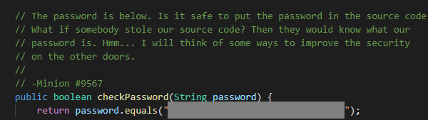

# [Easy] [Reverse] vault-door-training

Your mission is to enter Dr. Evil's laboratory and retrieve the blueprints for his Doomsday Project. The laboratory is protected by a series of locked vault doors. Each door is controlled by a computer and requires a password to open. Unfortunately, our undercover agents have not been able to obtain the secret passwords for the vault doors, but one of our junior agents obtained the source code for each vault's computer! You will need to read the source code for each level to figure out what the password is for that vault door. As a warmup, we have created a replica vault in our training facility. The source code for the training vault is here: [VaultDoorTraining.java](https://jupiter.challenges.picoctf.org/static/a4a1ca9c54d8fac9404f9cbc50d9751a/VaultDoorTraining.java)

##### Hint

> The password is revealed in the program's source code.

## WP

直接打开源码即可看到Flag，用`picoCTF{}`进行包裹后即为完整Flag。

