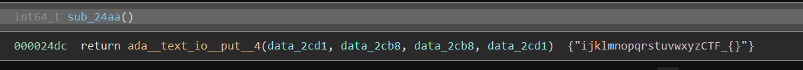

# Hurry up! Wait!

[svchost.exe](https://mercury.picoctf.net/static/fd201a72f0c75546e682537feac07c85/svchost.exe)

## WP

Disassembly the `.exe` file, and we can find that the main function is pretty short, but it called three functions.

```
00001fed  *gnat_argc = argc
00001ff7  *gnat_argv = argv
00002002  *gnat_envp = envp
00002010  void var_10
00002010  __gnat_initialize(&var_10)
00002015  sub_1d7c()
0000201a  sub_298a()
0000201f  sub_1d52()
00002024  __gnat_finalize()
00002030  return zx.q(*gnat_exit_status)
```

Inspect each of the function, and we can find that in `sub_298a()` it called a lot of other functions.

```
00002998  ada__calendar__delays__delay_for(0x38d7ea4c68000)
0000299d  sub_2616()
000029a2  sub_24aa()
000029a7  sub_2372()
000029ac  sub_25e2()
000029b1  sub_2852()
000029b6  sub_2886()
000029bb  sub_28ba()
000029c0  sub_2922()
000029c5  sub_23a6()
000029ca  sub_2136()
000029cf  sub_2206()
000029d4  sub_230a()
000029d9  sub_2206()
000029de  sub_257a()
000029e3  sub_28ee()
000029e8  sub_240e()
000029ed  sub_26e6()
000029f2  sub_2782()
000029f7  sub_28ee()
000029fc  sub_2102()
00002a01  sub_23da()
00002a06  sub_226e()
00002a0b  sub_21d2()
00002a10  sub_2372()
00002a15  sub_23a6()
00002a1a  sub_21d2()
00002a26  return sub_2956()
```

Inspect one function and we can find that each of the functions will print one character (the first character of the string).



Join the characters into one string and we can get the flag.

