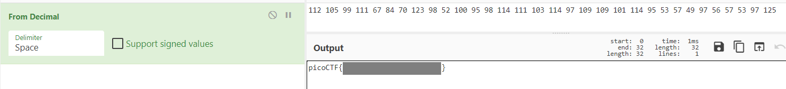

# Shop

Best Stuff - Cheap Stuff, Buy Buy Buy... Store Instance: [source](https://mercury.picoctf.net/static/e8e966fcaa1ff5ea48574046d0cf9c19/source). The shop is open for business at `nc mercury.picoctf.net 37799`.

## WP

这道题其实和逆向没什么大关系。

连接至给定端口，发现是一个模拟商店购买的程序，尝试购买负数个商品，发现没有进行限制。

购买负数个商品会使我们的余额增加，因此我们可以购买一定数量的负数个商品直到余额超过100，然后购买Flag即可。

拿到的Flag是个十进制数据，明显为ASCII码。解码后可得到Flag。

