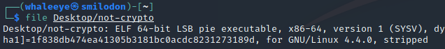
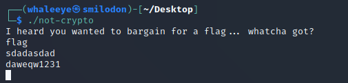
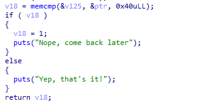
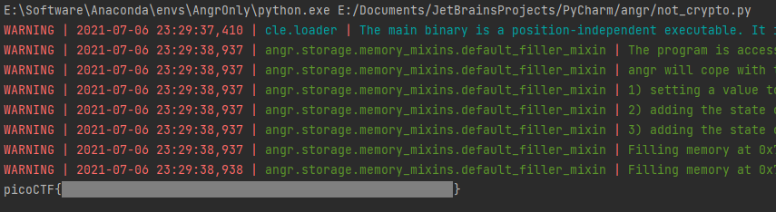

# not crypto

there's crypto in here but the challenge is not crypto... 🤔

[not-crypto](https://artifacts.picoctf.net/picoMini+by+redpwn/Reverse+Engineering/not-crypto/not-crypto)

## WP

下载文件并检查，发现是一个可执行文件。



尝试执行，输出**I heard you wanted to bargain for a flag... whatcha got?**，意义不明。



对程序进行反编译，发现最后会将两块内存内容进行比较，不用说一块肯定是用户输入缓冲区，另一块就是预置的Flag。



然而，前面预置Flag的过程过于复杂，手动分析太累了（懒），因此考虑使用angr自动化分析。

自动分析脚本如下：

```python
import angr

sim = angr.Project('./not-crypto').factory.simgr()
sim.explore(find=lambda s: b"Yep, that's it!" in s.posix.dumps(1))
print(sim.found[0].posix.dumps(0).decode())
```

分析后得到Flag。

