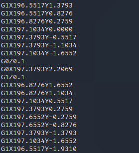
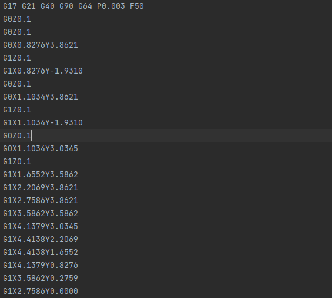

# speeds and feeds

There is something on my shop network running at `nc mercury.picoctf.net 20301`, but I can't tell what it is. Can you?

## WP

连接到服务器，发现程序打印了大量数据。



直接在Shell中分析有点困难，先使用脚本将其保存下来。

```python
from pwn import *

conn = remote('mercury.picoctf.net', 20301)
data = conn.recvall()
with open('recvdata', 'w', encoding='utf-8') as f:
    f.write(data.decode())
```



根据保存下来的文件中的关键字进行搜索，发现这其实是数控机床的控制指令（？）。

其中G0表示定位，即将定位点从当前位置移动到目标坐标。

G1表示画线，即在当前定位点和目标坐标之间画一条线，并将定位点移至目标坐标。

因此，这个文件描述了一个数控机床的移动轨迹，将这个轨迹可视化，很有可能就是关键信息。

使用脚本将该轨迹画出来，脚本如下：

```python
from PIL import Image, ImageDraw
import re

new_img = Image.new(mode='RGB', size=(1000, 100), color=(255, 255, 255))
new_draw = ImageDraw.Draw(new_img, mode='RGB')
temp_x = 0
temp_y = 0

with open('recvdata', 'r', encoding='utf-8') as f:
    file = f.readlines()
    for data in file:
        re_rst = re.search('G(.*)X(.*)Y(.*)', data)
        if re_rst:
            if int(re_rst.group(1)) == 0:
                new_draw.point((int(float(re_rst.group(2)) * 5), 50 - int(float(re_rst.group(3)) * 5)),
                               'black')
            else:
                new_draw.line(
                    (temp_x, 50 - temp_y, int(float(re_rst.group(2)) * 5),
                     50 - int(float(re_rst.group(3)) * 5)),
                    'black')
            temp_x = int(float(re_rst.group(2)) * 5)
            temp_y = int(float(re_rst.group(3)) * 5)

with open('analyzepic.png', 'wb') as f:
    new_img.save(f, format='png')

new_img.show()
```

最终得到的图像中即是Flag。


