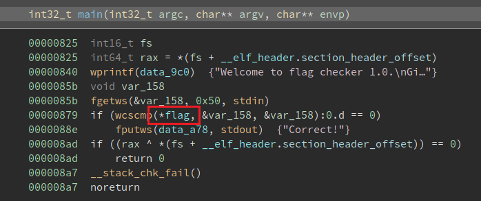
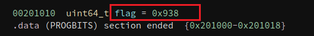
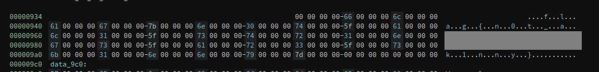

# wstrings

Some strings are wider than normal...

[wstrings](http://ctf.infury.org:8000/files/d26f4f00e15bf48f8492d58139942c55/wstrings?token=eyJ1c2VyX2lkIjoxNCwidGVhbV9pZCI6bnVsbCwiZmlsZV9pZCI6NTF9.YPuLGw.2Rp7r0HCzPyifvLLgFuUwH9Ai_Q)

## WP

运行下载的文件，发现是一个输入Flag然后进行检查的程序。

很明显程序中使用了字符串匹配的方式，因此直接反编译程序查找匹配逻辑。

`main`函数中，找到`flag`指针。

进一步查找，发现`flag`指针指向了`0x938`。

查看`0x938`代码段，即可发现Flag。

