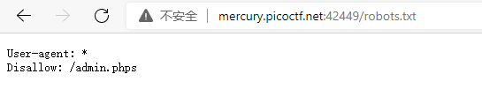
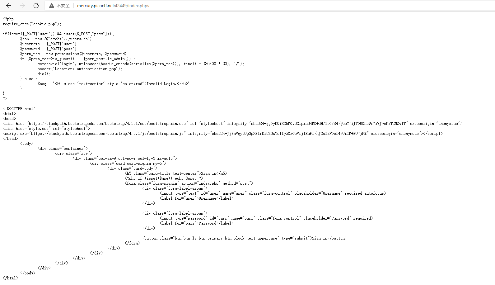

# Super Serial

Try to recover the flag stored on this website http://mercury.picoctf.net:42449/。

## WP

进入网页后，看到一个登录界面，使用一些常见的payload进行SQL注入，失败。


在网页源码中也没有看到关键的信息，于是想去看看网站有没有`robots.txt`碰碰运气，没想到真的有，且屏蔽了`/admin.phps`页面。



然而，当我尝试访问`/admin.phps`时，却发现没有这个页面。不仅如此，`admin.php`也显示为Not Found。

思路似乎断了，但是`.phps`后缀名给了我一点启发：会不会在这个网站的目录下存在着很多以`.phps`为后缀的文件呢？

尝试访问`index.phps`，居然成功了，而且还回显了`index.php`的源码。



顺藤摸瓜，发现了`cookie.phps`和`authentication.phps`，这两个页面也分别包含了`cookie.php`和`authentication.php`的源码。

整理出该网站登录并检测用户身份的过程：

1. 将用户输入的账号和密码放入数据库查询，若查询到用户，生成一个permission对象并序列化后将Cookie中的login值设置为使用BASE64编码的序列化后的字符串。（`index.php`）

   ```php
   if(isset($_POST["user"]) && isset($_POST["pass"])){
   	$con = new SQLite3("../users.db");
   	$username = $_POST["user"];
   	$password = $_POST["pass"];
   	$perm_res = new permissions($username, $password);
   	if ($perm_res->is_guest() || $perm_res->is_admin()) {
   		setcookie("login", urlencode(base64_encode(serialize($perm_res))), time() + (86400 * 30), "/");
   		header("Location: authentication.php");
   		die();
   	} else {
   		$msg = '<h6 class="text-center" style="color:red">Invalid Login.</h6>';
   	}
   }
   ```

2. 当用户访问时，若Cookie信息中包含login，则将该对象反序列化后解析，并分析出该用户的身份为admin还是guest。（`cookie.php`）

   ```php
   if(isset($_COOKIE["login"])){
   	try{
   		$perm = unserialize(base64_decode(urldecode($_COOKIE["login"])));
   		$g = $perm->is_guest();
   		$a = $perm->is_admin();
   	}
   	catch(Error $e){
   		die("Deserialization error. ".$perm);
   	}
   }
   ```

3. 根据用户的身份显示不同的信息。（`authentication.php`）

   ```php
   if(isset($perm) && $perm->is_admin()){
   	$msg = "Welcome admin";
   	$log = new access_log("access.log");
   	$log->append_to_log("Logged in at ".date("Y-m-d")."\n");
   } else {
   	$msg = "Welcome guest";
   }
   ?>
   ```

目前推测`access.log`中有重要信息，但是还没有找到进一步深入的方法，推测为反序列化漏洞。

<hr>

这道题的关键在于利用`cookie.php`中的反序列化的**错误回显**来获取到Flag。

如下所示，在`$perm`反序列化出现错误时，会打印`"Deserialization error. ".$perm`，也就是说会调用`$perm`的`__toString()`方法将其打印。

```php
catch(Error $e){
		die("Deserialization error. ".$perm);
	}
```

这道题无法使用正常的反序列化注入来绕过登录，但是`authentication.php`中的`access_log`类给我们提供了一个读取文件的机会。

```php
class access_log
{
	public $log_file;

	function __construct($lf) {
		$this->log_file = $lf;
	}

	function __toString() {
		return $this->read_log();
	}

	function append_to_log($data) {
		file_put_contents($this->log_file, $data, FILE_APPEND);
	}

	function read_log() {
		return file_get_contents($this->log_file);
	}
}
```

`access_log`类可以使用一个文件初始化，且其`__toString()`方法会直接将文件的内容返回。

这样，我们的思路就是：

1. 使用`../flag`初始化一个`access_log`对象并将其序列化后进行BASE64编码，然后进行URL编码。

2. 将Cookie中login的值设置为编码后的序列化字符串。

   

3. 访问`/authentication.php`，由于反序列化错误，会回显文件内容，得到Flag。


