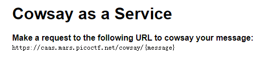

# [Easy] [Web] caas

Now presenting [cowsay as a service](https://caas.mars.picoctf.net/)

https://artifacts.picoctf.net/picoMini+by+redpwn/Web+Exploitation/caas/index.js

## WP

进入题给网页，发现是一个会将我们输入信息使用Cowsay执行的网页。



例如输入Hello，就会返回`Cowsay Hello`的结果。


题目中已经给定了该网页的后端源码，其中可以发现是通过以下代码来完成Cowsay的调用的：

```JS
app.get('/cowsay/:message', (req, res) => {
  exec(`/usr/games/cowsay ${req.params.message}`, {timeout: 5000}, (error, stdout) => {
    if (error) return res.status(500).end();
    res.type('txt').send(stdout).end();
  });
});
```

其中使用了`exec()`函数执行bash命令，且没有过滤请求中的字符，我们输入什么就会执行什么。

很容易就想到，我们可以让服务器除了执行`Cowsay`之外，再执行任意的我们想要的语句，只要先写一个`;`将前面的语句闭合即可。

使用payload`Hello;ls`测试，成功。


发现目录下有一个名为`falg.txt`的文件，使用payload为`Hello;cat falg.txt`，成功获取到Flag。

