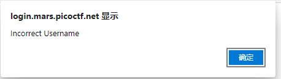
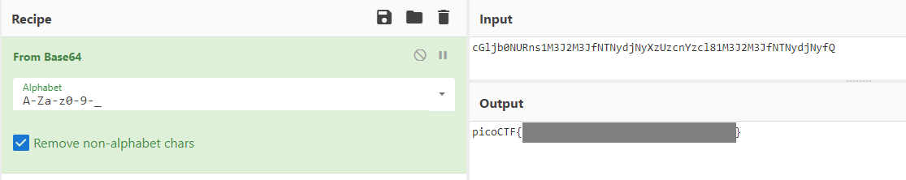

# login

My dog-sitter's brother made this website but I can't get in; can you help?

[login.mars.picoctf.net](https://login.mars.picoctf.net/)

## WP

打开题给网站发现是一个登录界面，尝试SQL注入失败，弹出提示窗口。



由窗口联想到JS脚本，查看JS代码，发现密码验证居然是在前端完成的。

```JS
(async()=>{
    await new Promise((e=>window.addEventListener("load", e))),
    document.querySelector("form").addEventListener("submit", (e=>{
        e.preventDefault();
        const r = {
            u: "input[name=username]",
            p: "input[name=password]"
        }
          , t = {};
        for (const e in r)
            t[e] = btoa(document.querySelector(r[e]).value).replace(/=/g, "");
        return "YWRtaW4" !== t.u ? alert("Incorrect Username") : "cGljb0NURns1M3J2M3JfNTNydjNyXzUzcnYzcl81M3J2M3JfNTNydjNyfQ" !== t.p ? alert("Incorrect Password") : void alert(`Correct Password! Your flag is ${atob(t.p)}.`)
    }
    ))
}
)();
```

验证逻辑就是将用户输入用BASE64进行编码后进行匹配，其中`btoa()`是BASE64编码的函数，`atob()`反之。

最终的Flag就是将密码使用BASE64解码后的结果。



