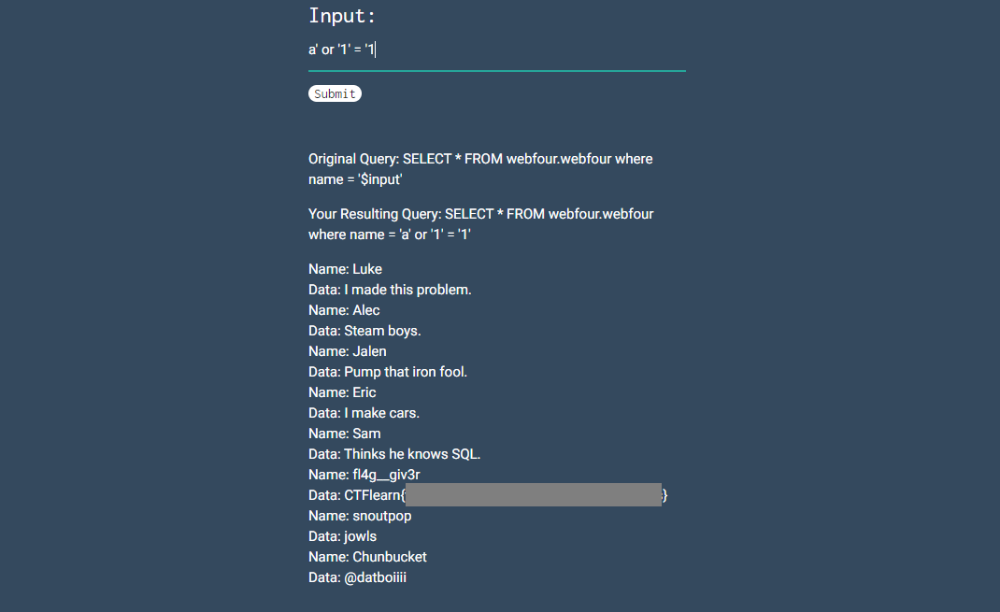

# Basic Injection

### Description

See if you can leak the whole database using what you know about SQL Injections. [link](https://web.ctflearn.com/web4/)

Don't know where to begin? Check out CTFlearn's [SQL Injection Lab](https://ctflearn.com/lab/sql-injection-part-1)

### Writeup

A simple SQL injection.

We can use payload `a' or '1' = '1` to select all the records in the database and get the flag.

