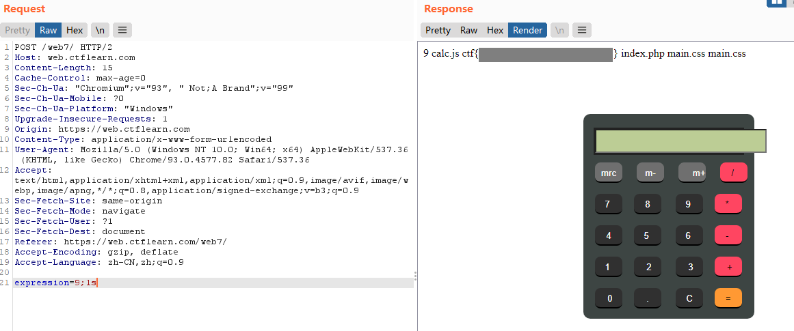

# Calculat3 M3

### Description

Here! http://web.ctflearn.com/web7/ I forget how we were doing those calculations, but something tells me it was pretty insecure.

### Writeup

Open the site and we can find it's a calculator program ran by a JS script.

Use Burp Suite we can find that the operators are sent by a POST request to the server in a parameter `expression`.

```http
POST /web7/ HTTP/2
Host: web.ctflearn.com
Content-Length: 17
Cache-Control: max-age=0
Sec-Ch-Ua: "Chromium";v="93", " Not;A Brand";v="99"
Sec-Ch-Ua-Mobile: ?0
Sec-Ch-Ua-Platform: "Windows"
Upgrade-Insecure-Requests: 1
User-Agent: Mozilla/5.0 (Windows NT 10.0; Win64; x64) AppleWebKit/537.36 (KHTML, like Gecko) Chrome/93.0.4577.82 Safari/537.36
Origin: https://web.ctflearn.com
Content-Type: application/x-www-form-urlencoded
Accept: text/html,application/xhtml+xml,application/xml;q=0.9,image/avif,image/webp,image/apng,*/*;q=0.8,application/signed-exchange;v=b3;q=0.9
Sec-Fetch-Site: same-origin
Sec-Fetch-Mode: navigate
Sec-Fetch-User: ?1
Sec-Fetch-Dest: document
Referer: https://web.ctflearn.com/web7/
Accept-Encoding: gzip, deflate
Accept-Language: zh-CN,zh;q=0.9

expression=9+*+9+
```

Check the JS script, we will find a code block like below:

```js
try 
{ 
  c(eval(document.getElementById("d").value)) 
} 
```

This is pretty insecure with function `eval()`. Use payload `expression=9;ls` to let the server execute the command `ls`, then we can get the flag.



