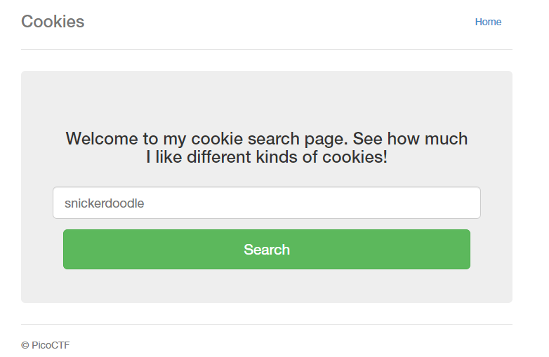
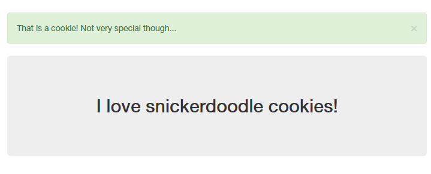
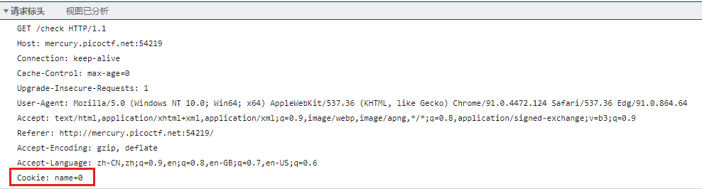
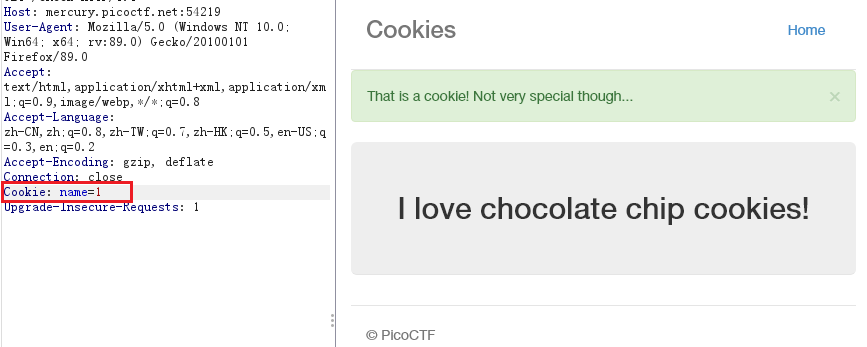
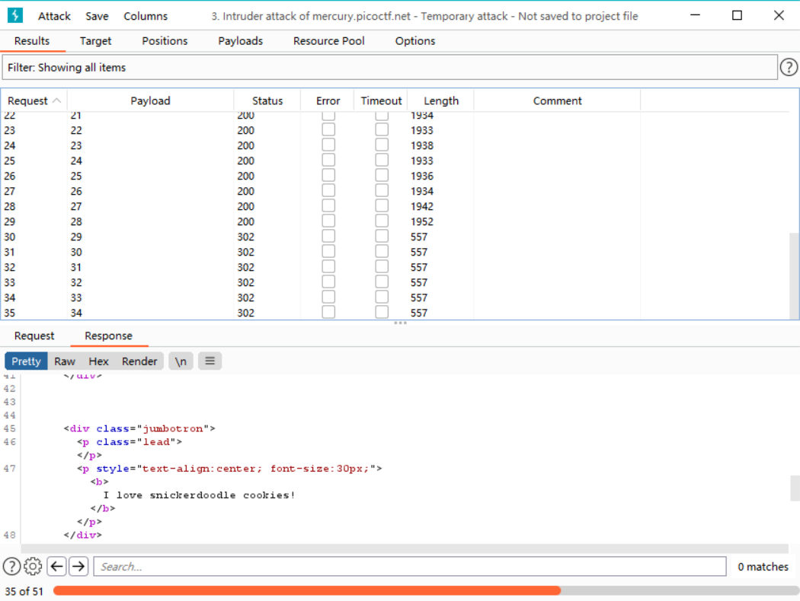
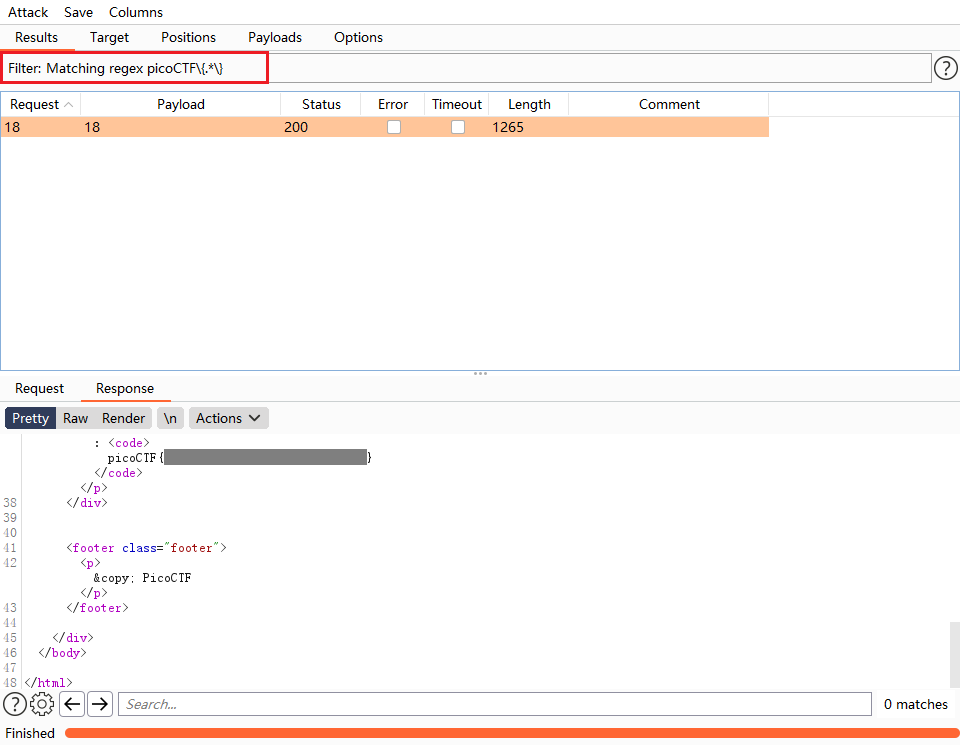

# Cookies

Who doesn't love cookies? Try to figure out the best one. http://mercury.picoctf.net:54219/

## WP

进入给定网页，发现是一个让我们输入`Cookie`的名字获取结果的网页。

尝试使用payload`1' or '1' = '1`进行SQL注入，失败。

直接输入snickerdoodle，跳转到`http://mercury.picoctf.net:54219/check`页面，提示**That is a cookie! Not very special though...**

然而，如果我们直接访问`/check`页面，会被直接重定向回搜索界面。

查看发送给`/check`的HTTP请求包，发现请求类型GET，且没有任何传参。结合题目Cookie，可以猜想`/check`页面是根据请求头中的Cookie来进行回包的。

在BurpSuite中抓包，将Cookie改为1并发包，回包产生了变化，猜想正确。但是此处依旧没有Flag。

猜想Cookie为某个特殊值时回显会有Flag，因此使用BurpSuite中的Intruder进行暴破。考虑到此处的Cookie类型不应该有很多，只对Cookie从0到50进行遍历。

从暴破结果中可见，从`Cookie: name=29`开始，后面的Cookie值均为无效。

使用Filter过滤表达式`picoCTF\{.*\}`，找到有Flag的包，在回包中可以看到Flag。

