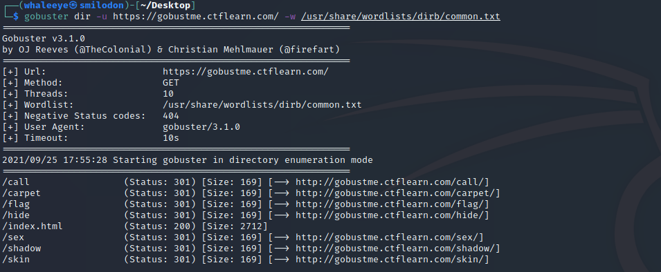
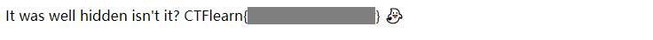

# Gobustme 👻

### Description

Some ghosts made this site 👻, it's a little spooky but theres a bunch of stuff hidden around.

[gobustme.ctflearn.com](https://gobustme.ctflearn.com/)

### Writeup

We can indicate from the title that this challenge may be a web directory brute force.

Enter the website, we can find that the challenge has not only gave us a hint about **Gobuster**, but even also offered us a download link and a dictionary.

Follow the hint, use the dictionary to brute force the website directory, then we can find some directories in  the website.

Open them one by one, then we can find the flag in one of them.

