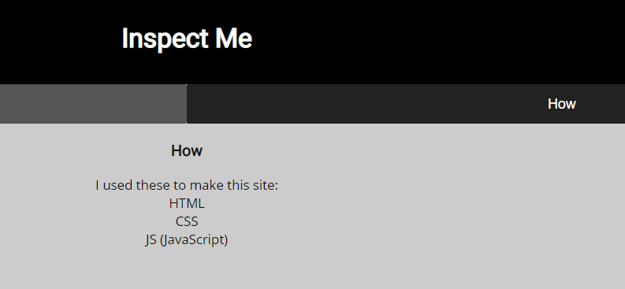
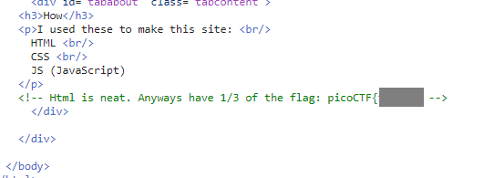
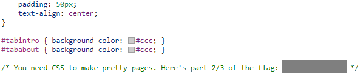
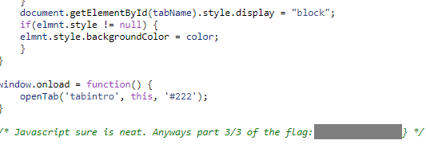

# Insp3ct0r

### Description

Kishor Balan tipped us off that the following code may need inspection: `https://jupiter.challenges.picoctf.org/problem/41511/` ([link](https://jupiter.challenges.picoctf.org/problem/41511/)) or http://jupiter.challenges.picoctf.org:41511

##### Hint 1

> How do you inspect web code on a browser?

##### Hint 2

> There's 3 parts.

### Writeup

进入网页后，点击How，看见如下界面。

根据提示，去HTML，CSS和JS的源码中寻找Flag。

HTML源码中找到第一部分的Flag。

CSS源码中找到第二部分的Flag。

JS源码中找到第三部分的Flag。三个部分拼在一起即得到最终Flag。