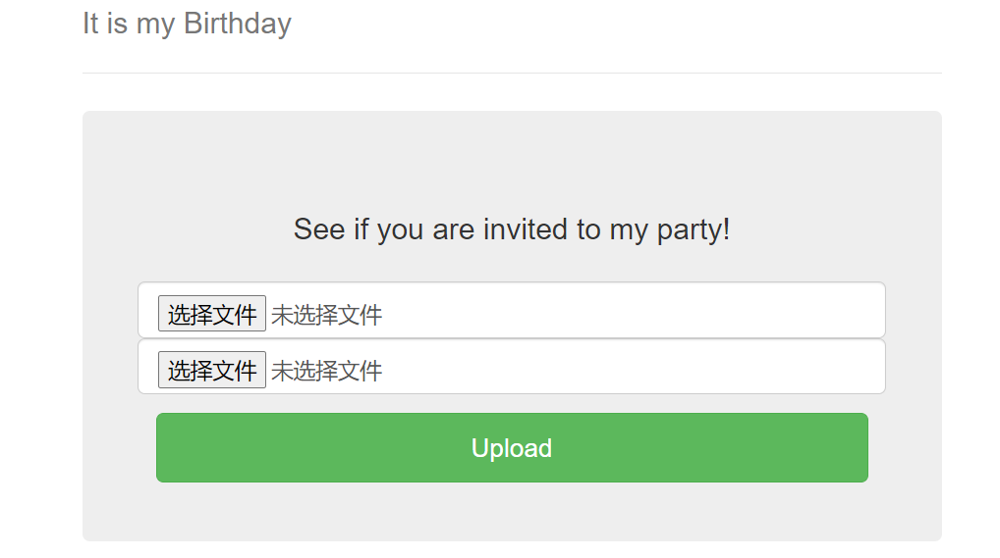
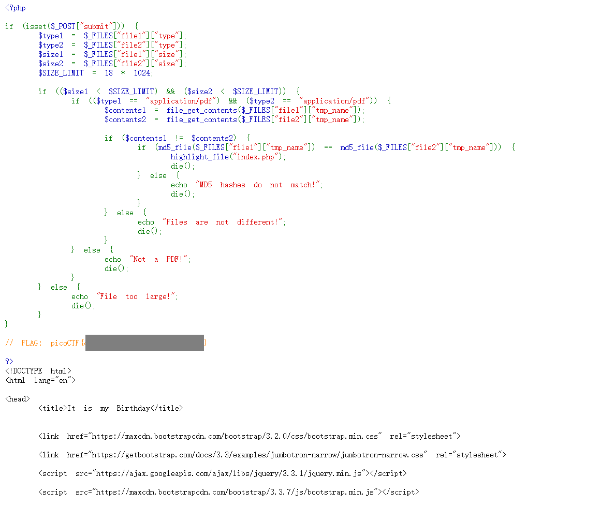

# It is my Birthday

### Description

I sent out 2 invitations to all of my friends for my birthday! I'll know if they get stolen because the two invites look similar, and they even have the same md5 hash, but they are slightly different! You wouldn't believe how long it took me to find a collision. Anyway, see if you're invited by submitting 2 PDFs to my website.

http://mercury.picoctf.net:63578/

##### Hint1

> Look at the category of this problem.

##### Hint2

> How may a PHP site check the rules in the description?

### WP

进入网站，来到一个上传文件的界面，且要上传两个文件。

根据题意，我们上传的两个文件需要满足这些标准：

+ 两个文件均需要为PDF
+ 两个文件不能一样
+ 两个文件的哈希校验值要一样

先提交两个不一样的PDF文件，提示MD5校验不通过。由此可知该网站的哈希算法是MD5。

经过试验，发现网页是根据请求头中的`Content-Type`来进行文件内容检测的，我们只需要抓包，然后将请求头中的`Content-Type`改成`application/pdf`，或者直接把后缀名改为`.pdf`即可绕过文件类型检测。

这样我们的思路就很明显了：先找出一对MD5哈希碰撞的值，然后将他们写到两个文件中，更改类型为PDF上传即可。

上传成功后，网页显示出了PHP源码，其中可以看到Flag。

