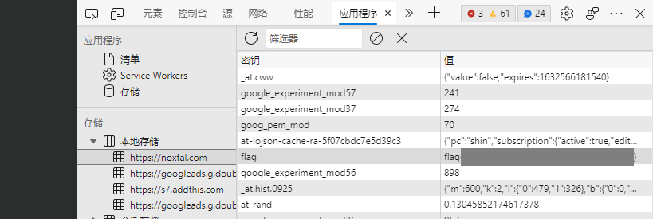

# My Blog

### Description

Hi, I'm Noxtal! I have hidden a flag somewhere in my [Cyberworld](https://noxtal.com/) (AKA blog)... you may find a good **application** for your **memory**. ;)

*Note: This is my real website (thus no deadly bug to exploit here). You might want to read some of my content (writeups, tutorials, and cheatsheets). I would be glad to receive any kind of feedback.*

[Click here](https://noxtal.com/) to access it, have fun checking my blog out! Cheers!

##### Hint

> replace the flag{} part with CTFlearn{}.

### Writeup

Enter the blog website, press `F12` to open the developer tools and check `Application --> Storage`, then we can get the flag at the local storage.

