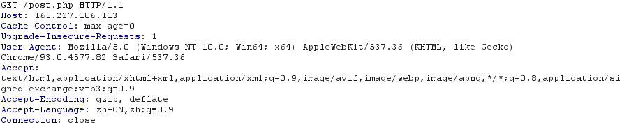
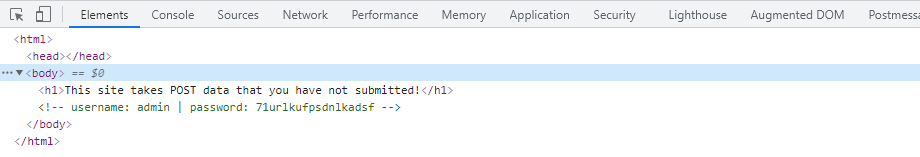
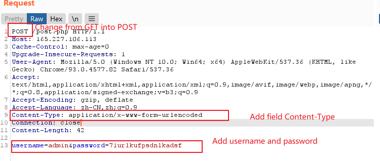
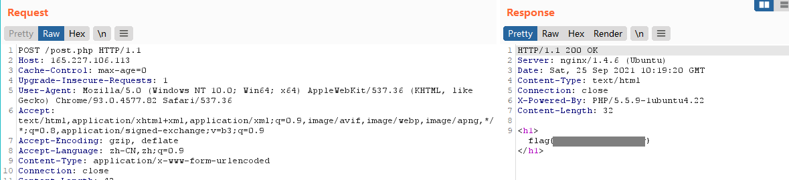

# POST Practice

### Description

This website requires authentication, via POST. However, it seems as if someone has defaced our site. Maybe there is still some way to authenticate? http://165.227.106.113/post.php

### Writeup

Enter the website, we find that this website needs to be accessed by POST requests, while our default request is a GET request.

Also, we can get the username and password in the source code of the webpage.

Use Burp Suite to modify the packet into a POST request.

Send it, then we can get the flag.

