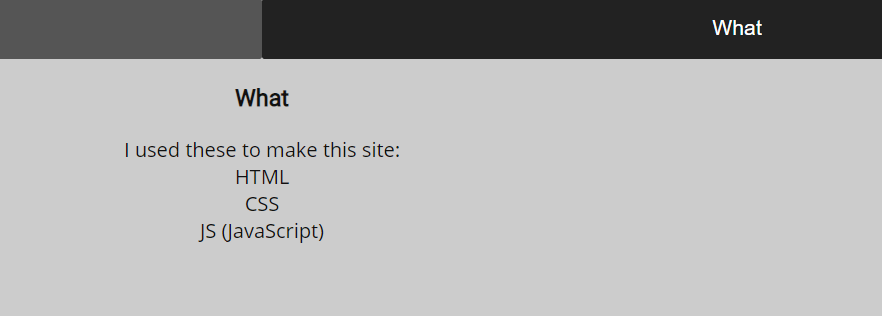
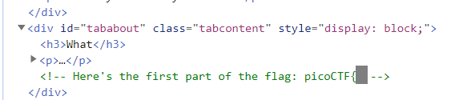
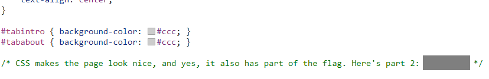
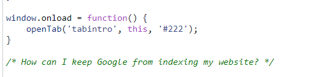
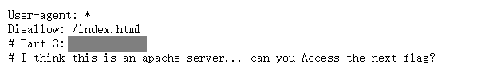
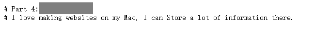
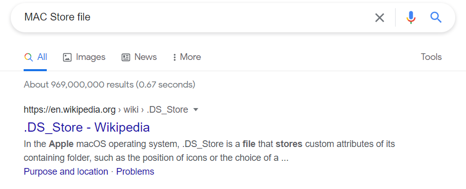
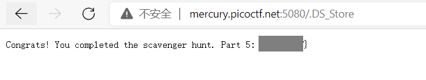

# Scavenger Hunt

There is some interesting information hidden around this site http://mercury.picoctf.net:5080/. Can you find it? 

##### Hint

> You should have enough hints to find the files, don't run a brute forcer.

## WP

进入网页后，点击What，可以看到一段文字：

文字中的提示告诉了我们该网页是用3种语言写成的：HTML，CSS，JS。 查看HTML源码，发现注释中有Flag的第一部分。

不出意外的话，剩下两个文件中应该有Flag的两个部分。

在`mycss.css`文件中得到Flag的第二部分。

在`myjs.js`中得到提示：**How can I keep Google from indexing my website?**

由这句话我们可以联想到Robots协议。查看该网页的`robots.txt`，得到Flag的第三部分。

根据Apache服务器的提示和Access字眼，我们联想到`.htaccess`文件，在该文件中获取到第四部分的 Flag。

根据Mac和Store字眼的提示，查询到在Mac中有一类`.DS_Store`文件可以保存定制信息。

查看网站的`.DS_Store`文件，就可以看到最后一部分的Flag。

将这五个部分拼在一起，就得到了最终的Flag。

